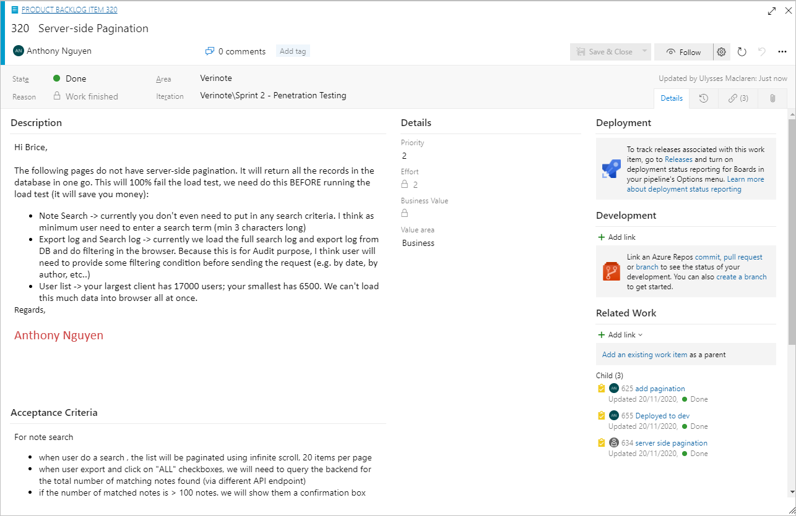

  
The work to be performed in the Sprint is planned at the Sprint Planning​ meeting. At the Sprint Planning meeting, the following three questions are answered:
<ul><li>Why is this Sprint valuable?​</li><li>What can be delivered in the Increment(s) resulting from the upcoming Sprint?</li><li>How will the work needed to deliver the Increment(s) be achieved?​</li></ul>

 <excerpt class='endintro'></excerpt> 
<h3 class="ssw15-rteElement-H3">Why is this Sprint valuable?​ </h3>
​​The Product Owner proposes how the product could increase its value and utility in the current Sprint. The whole Scrum Team then collaborates to define a Sprint Goal that communicates why the Sprint is valuable to stakeholders. 

What can​ be delivered in the Increment resulting from the upcoming Sprint?

The Product Backlog is examined and the Product Owner makes changes so that it is prioritised with Bugs prioritised amongst Product Backlog Items (PBIs). 

The Product Owner is then asked to group the top ranking Bugs into PBIs for inclusion in the Sprint; see this <a shape="rect" href="/Pages/BugsontheProductBacklog.aspx">rule</a>. 

The Team are then advised of their resourcing for the Sprint as there may be additions, subtractions, leave or public holidays which are different to the previous sprint. Considering their previous record and their current resources, The Team decide on the number of story points that they will deliver in the forthcoming Sprint. When The Team are not currently co-located this is often done by voting, and discussed until consensus is reached. 

The Team then size (assign Story points to) PBIs starting at the top until there are more than enough PBIs to fill the Sprint.

The process of sizing is somewhat formal. Either using cards or IM (essential if not co-located) the team vote privately on the size of the PBI. They can either use T-shirt sizes of XXS, XS, S, M, L, XL, XXL and XXXL or their equivalent number of story points for which we use the Doubling Series of 1, 2, 4, 8, 16 or 32. Once the differring votes are in, the Scrum Master asks the smallest and biggest voters to explain the reasons for their vote. Assumtions and omisions are quickly identified through discussions and the Scrum Master encourages discussion until consensus on the Story points is reached. Any PBI voted at 16 or higher should be broken down into smaller stories; re-prioritised by the Product Owner and re-sized if necessary. 
<dl><dt>
      
    </dt><dd class="ms-rteCustom-FigureNormal">Figure: A sample PBI based on the Microsoft Scrum process template for Azure DevOps </dd>
Once enough stories are sized, the P​roduct Owner is given the opportunity to re-prioritise now knowing the relative sizes. If more PBIs need then be sized then they are. The Scrum Master keeps everything going and facilitates negotiation between The Team and The Product Owner until final priority is confirmed and The team commit to a number of stories and the meeting concludes.
      This meeting should be timeboxed to an hour for every week in the Sprint. However, the Scrum Master must be sensitive to the meeting producing a workable result.​
      
   

</dl><h3 class="ssw15-rteElement-H3">​How will the work needed to deliver the Increment be achieved?​​ </h3>
To answer the second question the team create tasks, with sub-tasks where necessary, for everything that needs to be done to implement the PBI.  Every task and sub-task should be given an estimate in hours and the same value placed in the Remaining field. 
 
  No actual work on the Sprint should start until this planning is complete.  It is these Remaining hours that determine the first value in the burndown chart which sets the Sprint on its way to completion.  There must be no omissions or The Team will start without an accurate burndown and we all know that "The Team is nothing without a burndown".  
  The Team should also ensure that the burndown chart is working and will be automatically sent to all members of The Scrum Team overnight.  
  
  The meeting concludes when The Team reports to the Scrum Master that their planning is complete and they are able to display the burndown chart.  
  Ideally this meeting is timeboxed to as many hours as there will be weeks in the Sprint.  However, this planning is so essential that it must continue to completion outside the meeting if necessary. 
  
  It is not essential for the Product Owner or the Scrum Master to be present for the whole meeting but they must be available for consultation. The Scrum ​Master should formally close the meeting.   Once this meeting is finished, the Scrum Master should email the Product Owner with a <a href="/Pages/Do-you-create-a-Sprint-Forecast-email.aspx">forecast</a>​.    
In Scrum, there are 4 meetings in total that you need to know about: 
   <ul><li>Sprint Planning Meeting (Described on this page) </li><li>
         <a shape="rect" href="/Pages/DailyScrumUpdateTasks.aspx" title="Update tasks before Daily Scrum Meeting" target="_blank">Scrum Meeting (Daily standup)</a> </li><li>
         <a shape="rect" href="/Pages/SprintReviewMeeting.aspx" title="Sprint Review Meeting" target="_blank">Sprint Review Meeting</a> </li><li>
         <a shape="rect" href="/Pages/RetrospectiveMeeting.aspx" title="Retrospective Meeting" target="_blank">Sprint Retrospective Meeting</a> ​</li></ul>  

