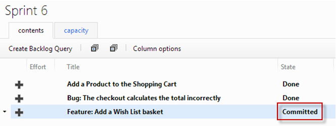
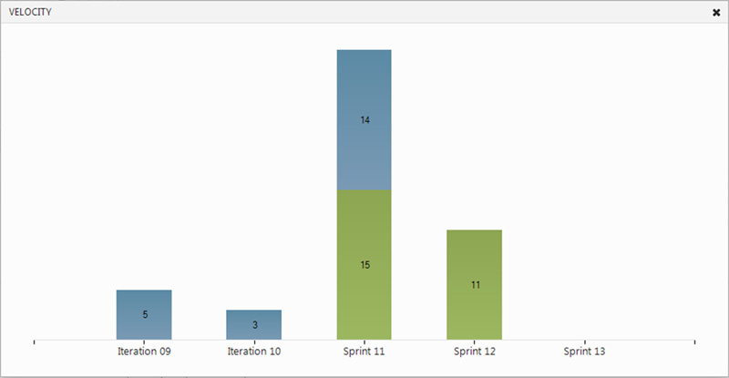
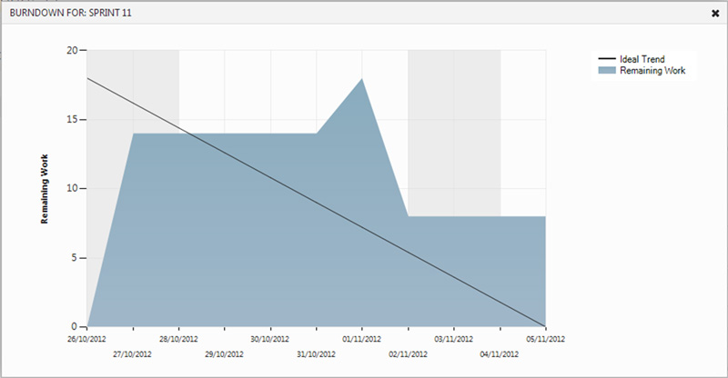
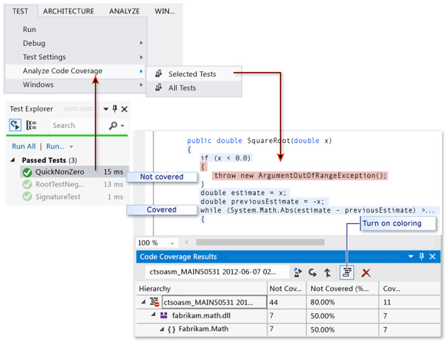
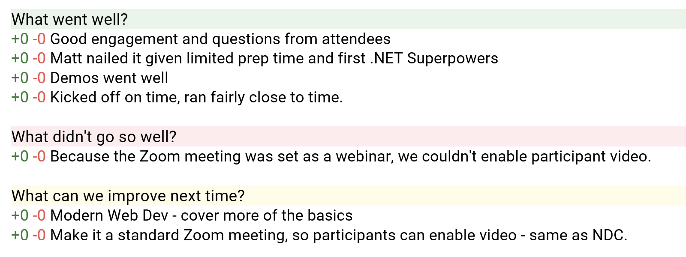
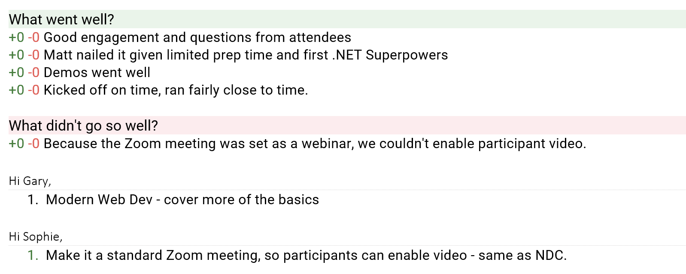

At the end of every **Sprint** the Development Team performs a **Sprint Retrospective** also known as the **Retro**.  The Retro provides an opportunity for the Scrum Team to reflect on what has gone well, what has gone poorly, and what the team wants to change.

Inspect-and-adapt is a key component of the Scrum framework and the Retro gives Scrum Teams an opportunity to learn from their successes and mistakes.

<!--endintro-->

The Retro is a time-boxed event that focuses around 3 questions:

1. **What went well?**
2. **What didn't go well?**
3. **What will we do differently in the next Sprint?**

The Scrum Master facilitates the meeting and collects issues as they are raised. Once every Scrum Team Member has spoken he facilitates debate on each issue so that team consensus is achieved.  The result should produce an actionable outcome, for example:

* An adjustment is made to the daily processes followed by the Scrum Team
* An adjustment is made to the [Definition of Done](/do-you-know-what-happens-at-a-sprint-retrospective-meeting)
* An adjustment is made at the organization level
* An item is added to the Product Backlog

To help aid discussion it can be useful for the Scrum Master to prepare items for review by inspecting the Sprint Backlog and statistics such as:

* Velocity
* Burndown
* Code Coverage
* Number of deployments
* Number of errors in Application Insights

As an example, the Scrum Master can find PBIs (Product Backlog Items) in the Sprint that were successful/not successful and then facilitate the discussion to find the reasons.

Once all issues have been discussed to the satisfaction of The Scrum Team, the meeting concludes.

If the timebox limit is reached, the remaining issues should be recorded and dealt with by the Scrum Master.  Any outstanding issues must be raised at the next Retrospective if they are still relevant.

The timebox for this meeting is usually as many hours as weeks in the Sprint.

### Using an interactive tool

You can do a [retrospected.com](https://www.retrospected.com/). The advantages are:

* Interactive - app participants can access the board (not one person writing an email, while others watch)
* Participants can upvote and downvote specific items on the retro
* Participants can add items to the board
* Participants feel more engaged with the process
* You can leave the board open (if some people have missed the Retro, they can add items afterwards)
* After you close the board, participants still have access to the Retro and can see what happened

::: bad

:::

::: good

:::

::: greybox
In Scrum, there are 4 meetings in total that you need to know about:

* [Sprint Planning Meeting](/do-you-know-what-happens-at-a-sprint-planning-meeting "Sprint Planning Meeting")
* [Scrum Meeting (Daily standup)](/meeting-do-you-update-your-tasks-before-the-daily-scrum "Update tasks before Daily Scrum Meeting")
* [Sprint Review Meeting](/do-you-know-what-happens-at-a-sprint-review-meeting "Sprint Review Meeting")
* Sprint Retrospective Meeting (Described on this page)

:::
