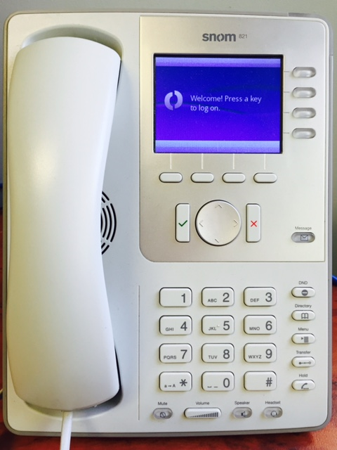
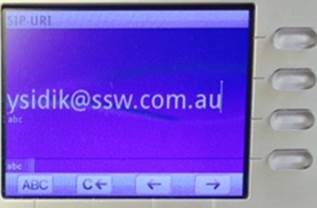
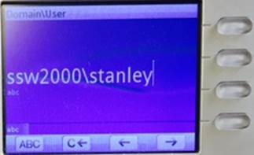
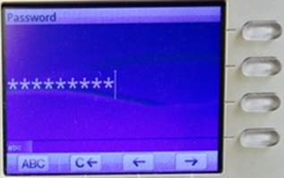

Before you rush out to purchase IP phones for the new Lync solution you have wanted to implement, you will need to consider if the IP phone are officially supported by Lync. At the time this article was published, Cisco is yet to offer a phone which supports Lync. 
<!--endintro-->
 As per  [IP Desk Phones page](http://technet.microsoft.com/en-us/lync/gg278172) we can see there are three vendors which supply IP phones which are supported by Lync. These three vendors are:  

* SNOM
* HP
* ASTRA

SNOM have been supporting OCS and Lync for many years. There phones are mainstream and offer good quality and features. This was our choice when purchasing IP desk phones.

Our review:

1. 821 model Ethernet ports support gigabit connection and can offer wireless connectivity
2. Ability to conference 5 people into an existing call
3. Headset support
4. User intuitive
5. Easy to source
6. Customization of Address book with Active Directory query's

While the differences between the different vendors were not hugely significant, SSW decided to go with SNOM as our base IP phone.

We also wanted standalone phones that did not require a computer.

Read more about     [implementing Microsoft Lync](http://www.ssw.com.au/ssw/Consulting/Lync.aspx).

### Set up phone

1. Log on to SNOM Phone, press a key to continue
<dl class="image">&lt;dt&gt;
                  
               &lt;/dt&gt;</dl>
2. Enter in your SIP-URI, that is emailaddress@ssw.com.au and press the green tick
<dl class="image">&lt;dt&gt;
                  
               &lt;/dt&gt;</dl>
3. Enter in your Domain\Username, that is ssw2000\username and press the green tick
<dl class="image">&lt;dt&gt;
                  
               &lt;/dt&gt;</dl>
4. Enter in your AD password and press the green tick
<dl class="image">&lt;dt&gt;
                  
               &lt;/dt&gt;</dl>

Congratulations, you are now able to make and receive phone calls.
