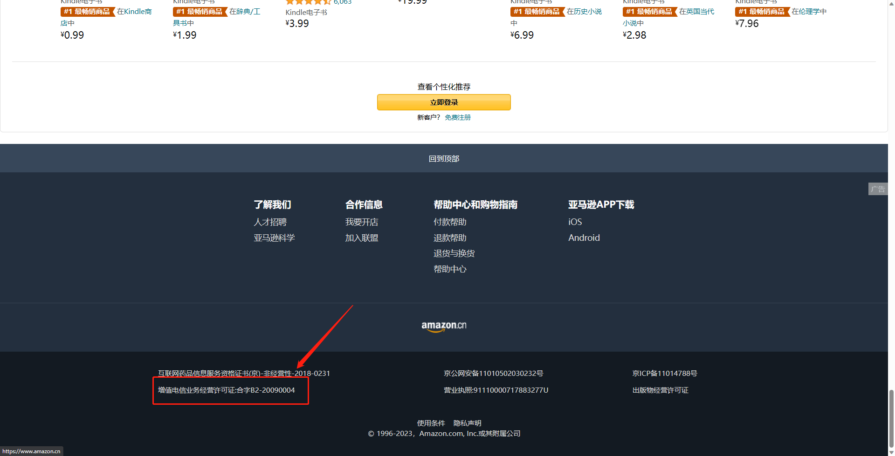

ICP (Internet Content Provider) license is for commercial websites, which covers any website which may derive direct income from providing online advertising, texts, images, audio, video, apps, etc. or providing information search services, information community platform, instant message services, and information protection services. 

According to the regulation ([Administrative Measures for Internet Information Services](https://www.21cloudbox.com/china-measures-for-the-administration-of-internet-information-services.html)), commercial websites must obtain an ICP license, including the following types of websites:
- E-commerce websites
- Online payment platforms
- Online travel platforms
- Online education platforms
- Online media websites (including news, audio and video, blogs, etc.)
- Online social media websites
- Online gaming platforms
- Other websites that provide Internet information services

::: good

:::
