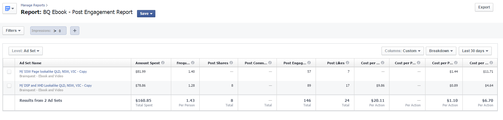
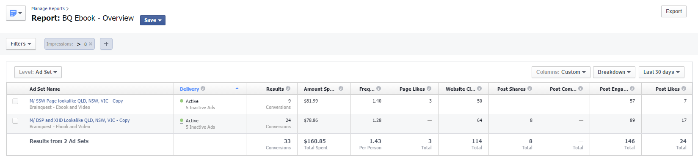

Facebook ads have a limited run. Often, ads will work for a certain period and then become ineffective. It is important to monitor ads regularly to see if they are still performing.

<!--endintro-->

Underperforming ads should be paused and tweaked before resuming use. The smaller the potential audience the quicker the ad will become less effective. Testing can be carried out on the copy, image, demographics and interest groups – altering these variables will give you a range of different results.

Reporting is vital to determining the success of any campaign, as it allows us to clearly see and compare each campaign and decide which should be altered as they are ineffective and which are performing well.

Facebook allows you to customize your reports, allowing you to measure the success of your campaign based on your goal. If your goal was post engagement you may want to customize your report to show Post Shares, Post Comments Post Engagement, Post Likes, Frequency, Cost Per Post Share, cost per Comment, Cost per Engagement and Cost Per Like. All of these factors are important to be looked at to provide a full overview of the campaign.

  

Other goals for Facebook Ads may be Page Likes, Conversions, and Website Clicks. An overview provides you with a basic report of your campaign, featuring; Results, Amount Spent, Frequency, Page Likes, Website Clicks, Post Shares, Post Comments, Post Engagement, and Post Likes.

