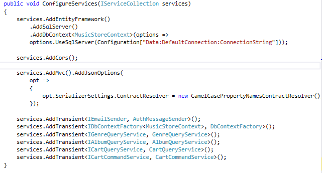
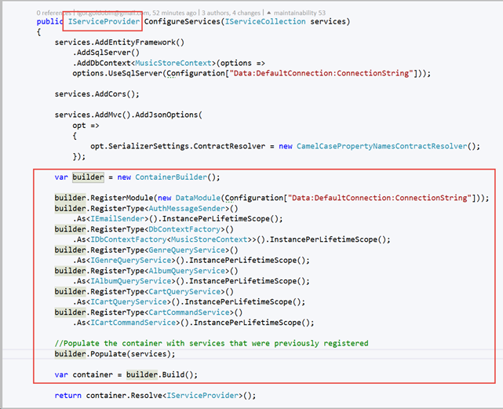

We already know what the [best IOC container is](/_layouts/15/FIXUPREDIRECT.ASPX?WebId=3dfc0e07-e23a-4cbb-aac2-e778b71166a2&TermSetId=07da3ddf-0924-4cd2-a6d4-a4809ae20160&TermId=0aa194e1-2de9-4ed1-b430-444109d65a50), but how does ASP.NET core's default dependency injection compare?

ASP.NET Core includes default dependency injection for new Web Apps in the Startup.cs file. This is adequate for simple projects, but not designed to compete with the features of alternatives containers (like AutoFac's convention based registration).

"The default services container provided by ASP.NET Core provides a minimal feature set and is not intended to replace other containers."

- Steve Smith, ([ASP.NET Dependency Injection](http://docs.asp.net/en/latest/fundamentals/dependency-injection.html))

<!--endintro-->

You can quickly flag this error and any more by using the [SSW Code Auditor](https://www.ssw.com.au/ssw/CodeAuditor/).

Here is an example of rewiring the default code to AutoFac with the [SSW's Music Store](https://github.com/SSWConsulting/enterprise-musicstore-ui-angular2)  app:

::: bad
Figure: Bad Example - The default dependency injection for ASP.NET Core

:::

::: good
Figure: Good Example - The bad example rewired to utilize AutoFac. Red boxes outline the modified code

:::

### Further Reading:

* [Do you use a dependency injection centric architecture?](/do-you-use-a-dependency-injection-centric-architecture)
* [Do you generate the VS dependency graph?](/do-you-generate-the-vs-dependency-graph)
* [Do you know the best dependency injection container? (aka Do not waste days evaluating IOC containers)](/do-you-know-the-best-dependency-injection-container-aka-do-not-waste-days-evaluating-ioc-containers)
