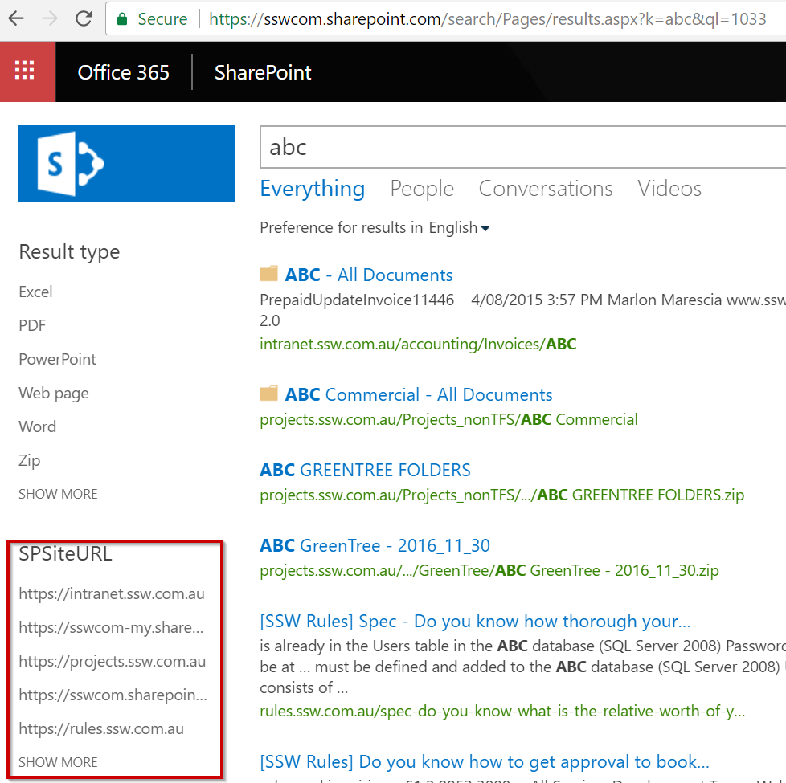

Although Sharegate migration tool works very well to help you with your SharePoint migration, some manual steps might be necessary to complete the migration. These extra steps include:  
 <excerpt class='endintro'></excerpt> 
<ul><li>Configuring any custom Search scopes/refinements </li><li>Remove permissions from On-premise Intranet (or turn it to Read-Only)</li><li>Ask users to change their mapped folders</li><li>Communicate about the changes</li></ul><dl class="image"><dt>​</dt><dd>Figure: After migration set your custom refinements so users can filter down into a specific area</dd></dl>
​​ 

