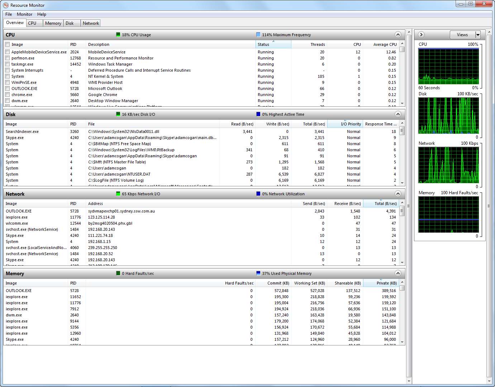
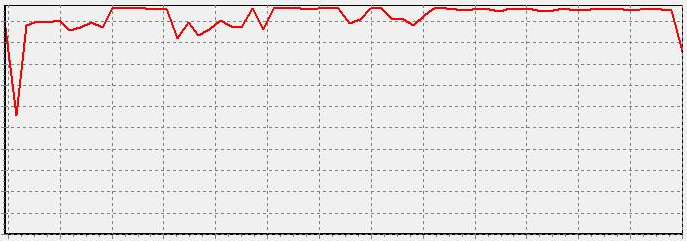

A “Too slow” is not enough info.

<!--endintro-->

Request an image of the “Resource Monitor”

Then after you decide there is justification:

- Do a typical action – take a new image or baseline.
- Give the additional resources e.g. Ram and processors...
- Do the typical action again – take another image of the “Resource Monitor”
- If there is some improvement, reply “done” (otherwise reply “not done”)

**Note:** An ideal email subject prefix for more resources would be e.g. “Performance issue – “Machine name”

