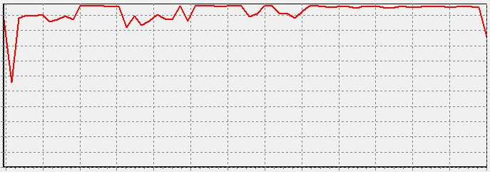

A “Too slow” is not enough info.

<!--endintro-->
Request an image of the “Resource Monitor”
Then after you decide there is justification:

•           Do a typical action – take a new image or baseline.

•           give the additional resources e.g. Ram and processors….

•           Do the typical action again – take another image of the “Resource Monitor”

•           If there is some improvement, reply “done” (otherwise reply “not done”)

Note: An ideal email subject prefix for more resources would be e.g. “Performance issue – “Machine name”

**
**

**Figure: Use “Resource Monitor” prior to allocating**  **more RAM on a VM**

**            Figure: If you see something like this, pass their request :-)**
