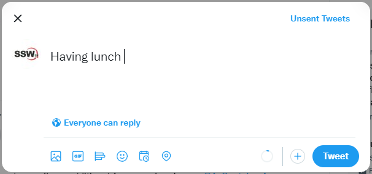
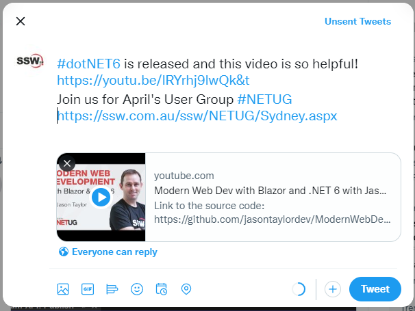

Your tweets should be interesting to your target audience. People aren't going to follow you for long if you make off topic and low value tweets.

<!--endintro-->

::: bad

:::

Some good examples of things to tweet about:

* One week before an event, tweet about the event to raise awareness 
* One day before an event, tweet about the event and what you are talking about
* On the day of the event, check-in on foursquare when you arrive (gives people a nice map)
* When something good happens to you. E.g. You beat your boss in an arm wrestle
* Tweet before and after installing new software or after an upgrade eg:

  * Installing #SharePoint for the first time
  * \#SharePoint install done - found a great guide to follow here: mysharepointsite.com

::: good

:::