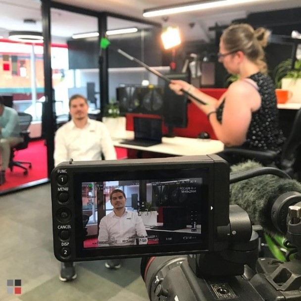
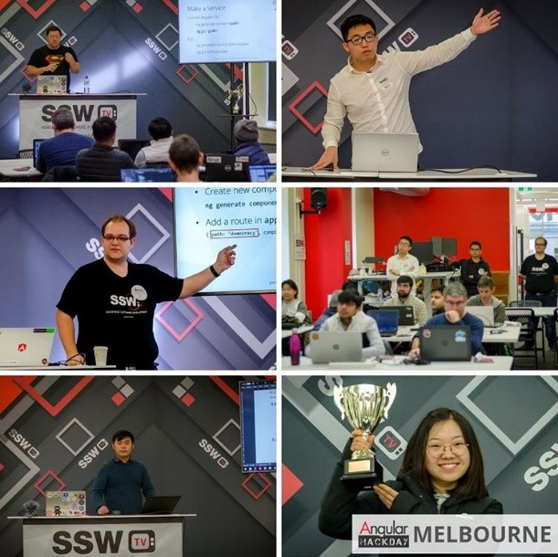
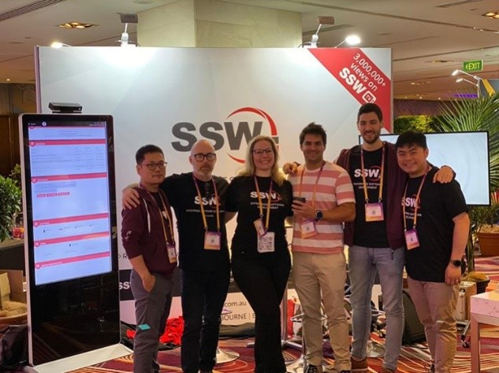
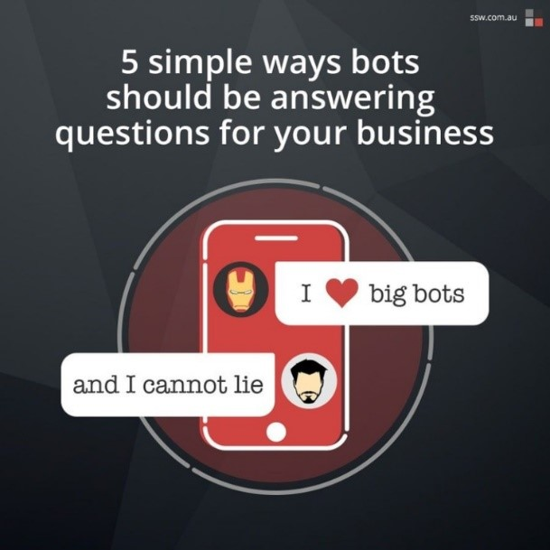
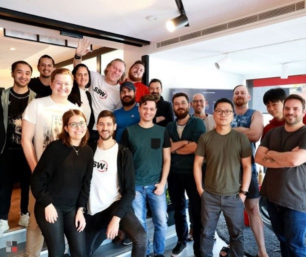

Sometimes it can be hard to keep generating content daily for your social media, and even more when there’s not much going on.

<!--endintro-->

So, here are a few examples taken from our social media of what you could post on yours:

### Internal projects, services or products that your business developed or offers

::: ok  
  
:::

### Projects that your company worked on

::: ok  
  
:::

### Video content

::: ok  
  
:::

### Events that your company organised

::: ok  
  
:::

::: ok  
  
:::

### External events that you and your team attended to

::: ok  
  
:::

### Your team members profile

::: ok  
  
:::

### Your employee's blogs posts

::: ok  
  
:::

### Your business blog posts

::: ok  
  
:::

### General content wrote by your team on your website

::: ok  
  
:::

### Employment opportunities

::: ok  
  
:::

### Teamwork, parties, etc

::: ok  
  
:::

### Relevant news for your industry

::: ok  
  
:::

### Memes, if they suit your industry

To see best practices for sharing memes on your socials, check out our Rule: [Do you know why you should use memes as part of your business social media content?](/do-you-know-why-you-should-use-memes-as-part-of-your-business-social-media-content)

::: ok  
  
:::
