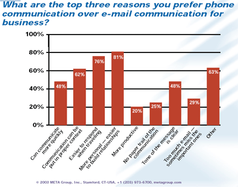
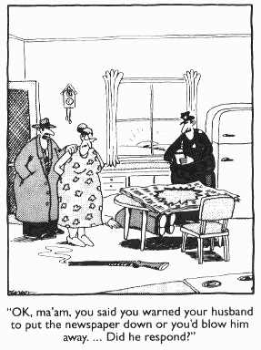

As all these rules indicate, email can either be a blessing or a curse. One of the most deadly of all the potential curses of email is when people choose to use email when it is just not the right tool for that particular task. Absolutely avoid email in the following situations:  
<!--endintro-->

 

 **Figures: a 
 [Meta Group survey](http://www.ssw.com.au/ssw/Redirect/SSWUpdate/0304MetagroupUsersPreferEmailPDFReport.htm) found that 81% of respondents preferred the phone above email to build relationships, but 80% preferred email generally** 
1. When you want to discuss an issue and make a decision
2. When you are dealing with a 'delicate' problem

**Making a Decision**

If you want to make a decision, asking for opinions via email is the best way to ensure one isn't made. Email discussions get off topic, lose track and generally go nowhere, with every email ending with "Yes, but what about..." or "Just my 2c". This leads to a lot of time-wasting.

You should either pick up the phone or have a meeting to discuss the issue, make a decision then and there, and then confirm the decision via email. The first line in your follow up email should be "[As per our conversation...](/Pages/DoYouAlwaysSendAnAsPerOurConversationEmail.aspx)" This records that a conversation was held.

The issue becomes even more important internally, when you email someone in the next office and ask them a question. This is a great way of creating unnecessary emails. Instead, stand up, walk to their desk and ask them the question. Otherwise, have a folder called "AskDavid" or similar, file all your emails that you need to ask him about in there, and when he next comes to visit you, go through them and get an answer.

**Dealing with Delicate Situations**

Similarly, never bring up a tricky topic with someone by email. It's very easy to misunderstand or misrepresent via email. We always pick up the phone and speak to the person first when discussing important, sensitive, complex issues, or issues where some serious convincing is required. This is the standard we follow:

* Draft the email covering the issues we want to confirm
* Call the person covering every issue outlined in the draft
* Adjust the email according to the decisions made together, adding "[As per our conversation...](/Pages/DoYouAlwaysSendAnAsPerOurConversationEmail.aspx)"
* Send the email

 This way you can review issues together, and, importantly, decisions are confirmed in writing. 

