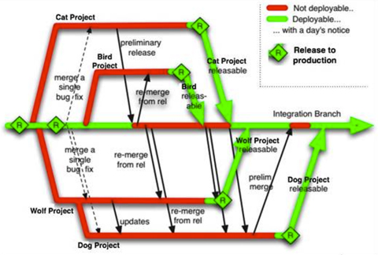
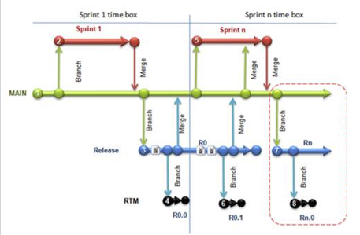

One of the most controversial issues developers discuss is when to create branches and how many you should have.

Keep things simple:

1. Have the team develop on the one branch. It is fantastic as there are no more merging hell.
2. Have that branch called " **master** " if using  **Git** and " **main** " or " **trunk** " when using  **TFS** or  **SVN**

Beware of smart bloggers giving the wrong advice :-) as many smart people like creating branches e.g. http://blog.hinshelwood.com/archive/2010/04/14/guidance-a-branching-strategy-for-scrum-teams.aspx. Even Martin Fowler says there are a number of issues related to merging that lead us to try and minimise the number of branches that we work with in his article on [Feature Branches](http://martinfowler.com/bliki/FeatureBranch.html).

The quintessential scenario you need to support is that emergency "Hey we have a security hole on the site and Hanselman has just tweeted it!"

In that case you need to potentially update all of your branches and perform deployment, which can be quite tiresome.

The better way is to use OctopusDeploy which relives developers from having multiple branches because you only have to worry about building on one branch and deployment can be done automatically to multiple environments. Octopus provides more secure, feature-rich environment which makes it very easy to deploy and promote builds between environments.
<dl class="goodImage">&lt;dt&gt;  &lt;/dt&gt;<dd>Figure: Good Example: Manage deployments to multiple environments, view deployed versions.  </dd></dl>
<!--endintro-->

### Why you should avoid branching

1. Merging is painful, complex and is a time consuming task that does not add value.
2. Often regressions are introduced as merges are missed and not merged back to trunk
3. The longer branches are, the more people that have worked on them... the more unpleasant the merge is going to be.
 Amount of pain = size of the change \* the amount of work on the trunk in that period
4. The more you need to create a branch, the harder it is going to be to merge it back into the trunk!
5. Branching impedes refactoring.
 If a am working on a branch and perform sweeping renaming, and a developer working on another branch does the same – merging is nearly impossible.
 This is         **very** likely to happen on code bases that require tidying when you have developers who believe in improving code as they go (see the        [Boy Scout Rule](http://www.ssw.com.au/ssw/standards/Rules/RulestoBetterCode.aspx#BoyscoutRule))

### When it's OK to branch

* For a disposable, investigatory spike
* To perform hotfixes to production environment

<dl class="badImage">&lt;dt&gt;
      
   &lt;/dt&gt;<dd>Figure: Bad Example – Creating a branch per feature leads to lots of merging (Image from<a href="http://paulhammant.com/blog/branch_by_abstraction.html">http://paulhammant.com/blog/branch_by_abstraction.html</a>    )</dd></dl><dl class="badImage">&lt;dt&gt;
      
   &lt;/dt&gt;<dd>Figure: Bad Example – Creating a branch per sprint has everyone working on the same code but requires at least one merge every sprint</dd></dl><dl class="goodImage">&lt;dt&gt;
      
   &lt;/dt&gt;<dd>Figure: Good Example: Release Branching - always develop on the trunk, but create a new branch each time you release.  This means that all developers are continually integrating all their code, branching is rare, but you always have access to your released version in case bug fixes or small mods are required. (Image from <a href="http://paulhammant.com/blog/branch_by_abstraction.html">http://paulhammant.com/blog/branch_by_abstraction.html</a>    )</dd></dl>
Further reading:

* http://continuousdelivery.com/2011/05/make-large-scale-changes-incrementally-with-branch-by-abstraction/ 
 
 
 

* [http://paulhammant.com/blog/branch\_by\_abstraction.html](http://paulhammant.com/blog/branch_by_abstraction.html) 
 
 
 

* http://martinfowler.com/bliki/FeatureBranch.html 
 
 
 

* http://martinfowler.com/bliki/SemanticConflict.html
