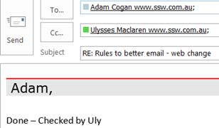
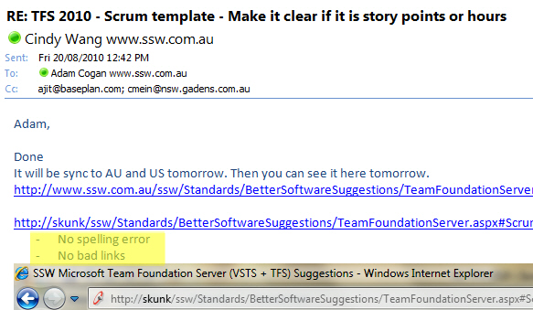

There are times you should have your email checked by someone else before sending. Simply ask for that person to come over and check it on your computer or IM him/her if the person is not close by (e.g. in a different room). This way you are guaranteed instant feedback and you won't clog up someone else's inbox with unnecessary emails.

Examples are:

<!--endintro-->

* Where you are a little unsure
* When you are new to a company and sending an email to a large distribution list
* Sending a complicated email
* Sending a sensitive email (where the content could be perceived as confrontational)
* In application development, when you need a quick '[test please](/_layouts/15/FIXUPREDIRECT.ASPX?WebId=3dfc0e07-e23a-4cbb-aac2-e778b71166a2&TermSetId=07da3ddf-0924-4cd2-a6d4-a4809ae20160&TermId=d66a9404-2ca9-4d19-ad6c-df1618b4fc28)', and the person is immediately available. This provides you a chance to check and collaborate on the finished change before the '[done email](/Pages/Done-GiveDetailsAndDelete.aspx)' is sent

Doing this will ensure:

* You avoid grammatical and spelling errors
* The layout and tone of the email is professional
* You haven’t forgotten anything important
* The receiver knows who else agrees with the content

::: greybox

Dear Adam,

(Checked by Peter)

[email content]

Regards, Phil

:::

**Figure: Use 'Checked by xxx' when sending a complicated email to a group of people
** 

Reply to the "Done" email like below and CC the person who checked the email for you. In this way, you show it was double checked.     <dl class="goodImage">&lt;dt&gt; 
          
      &lt;/dt&gt;<dd>Figure: Reply Email with "Checked by XXX"  </dd></dl>
When you action a task for adding web content (such as a rule or suggestion), firstly paste the content into a new Word file and run the "Grammar & Spelling Check" to check if there are any errors. After the "Grammar & Spelling Check", you can add it to your website. After that, run        [Link Auditor](http://sswlinkauditor.com/) in order to keep 0 bad links on that page.

<dl class="goodImage">&lt;dt&gt; 
       
   &lt;/dt&gt;<dd>Figure: Reply to the email with grammar & spelling check and CA check results </dd></dl><dl class="image">&lt;dt&gt;
      
   &lt;/dt&gt;<dd>Figure: Consider this the '4 eye check' (<a href="https://www.collinsdictionary.com/dictionary/english/four-eyes-principle" target="_blank">four eye principle</a>) </dd></dl>
