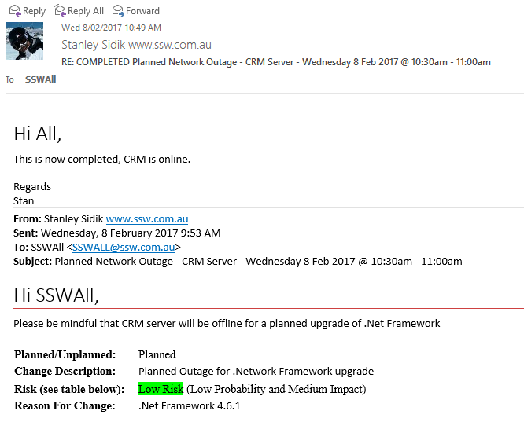

Large distribution group emails (e.g NorthwindAll@, SSWAll@) should be used for critical information or emails that require feedback from users. For general information, or random posts reduce email noise by using and IM group (e.g. Microsoft Teams).

<!--endintro-->

Group emails serve an important purpose in providing information to the entire organisation in a way that is less likely to get lost than an Instant Message.  Its also provides a good method of allowing for a good cross section of staff responses. IM messages are better suited to general comments/information or random posts.

::: bad

:::

::: bad

:::

::: good

:::

::: good

:::
