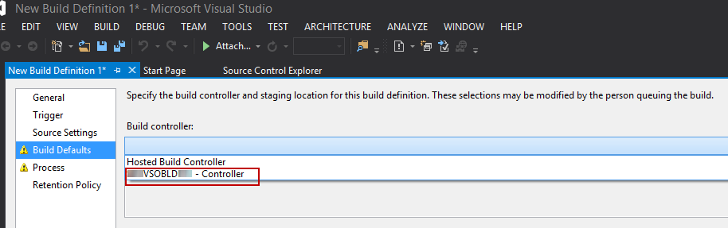

If you are using [Visual Studio Online](http://www.visualstudio.com/), there's an awesome [Hosted Build Server](http://blogs.msdn.com/b/visualstudioalm/archive/2012/03/27/build-on-the-team-foundation-service.aspx) option you can use to perform your builds with little to no setup. But if you're working on a project that has continuous integration and a long build time, it's not long before those build minutes start to add up. 
<!--endintro-->
To reduce your build costs, you could reduce the number of builds or try to reduce the build time. Continuous integration is very important so you don't want to turn that off, and [we encourage checking in early and often](http://www.ssw.com.au/ssw/Standards/Rules/RulesToBetterSourceControlwithTFS.aspx#CheckinRegularly). Reducing the build time is a nice idea, but you can't always reduce it enough to make a difference.

For large, expensive projects, the best option is to configure an on-premises build server rather than using hosted builds.

To configure an on-premises build server for Visual Studio Online, check out Anthony Borton's great walkthrough:

http://myalmblog.com/2014/04/13/configuring-on-premises-build-server-for-visual-studio-online/

Once you have a build server configured, you'll be able to see the build controller as an option when you configure a new build definition.

::: good
Figure: Good Example - We have the option of an on-premises build controller as well as the Hosted Build controller
:::
