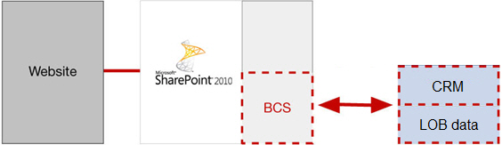
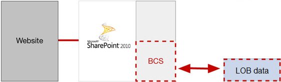

If you want an easy way to access data in remote or legacy systems, provide one or more of the CRUD operations to the end users and search the data within the SharePoint search framework, then you should consider BCS. You can also use MS Office applications to access the data from SharePoint.

 However, BCS doesn't do everything.  It does not provide support for WorkFlow or EventReceivers on the list in SharePoint.  

 BCS is good for synchronising the data at SharePoint with one other system.  It is not suitable for publishing the data to multiple systems (i.e. syndication). If you need to implement syndication, use a standard SharePoint List and attach either a Workflow or an EventReceiver to handle sending updates to the end systems instead.

<!--endintro-->

 

::: bad
Use BCS with multiple systems(not working)

:::

::: good
Use BCS with one system at time  
:::
