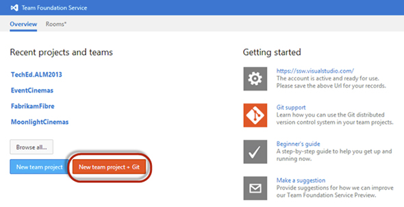

​Team Foundation Server Update 2 and Team Foundation Server 2013 comes with built in support for Git as a version control system.​

 <excerpt class='endintro'></excerpt> 
<dl class="image"><dt></dt><dd>Figure: How you start using Git on TFS</dd>​
</dl>
You should use Git if you:
<ul><li>Are running an open source project</li><li>Have lots of remote team members (as you get offline repo access with full history)</li><li>Have an unstable/sporadic internet connection</li><li>Develop in a non Microsoft environment (e.g. Linux, OSX)</li></ul>
There are also several disadvantages:
<ul><li>No "My Work" view in Team Explorer</li><li>No "Code Review" integration in Visual Studio</li><li>No "Check in Policies"</li><li>No SOX, FDA or CFD-11 compliance</li></ul>
At this point, SSW still recommends Team Foundation Version Control (TFVC) as the version control system of choice.​

