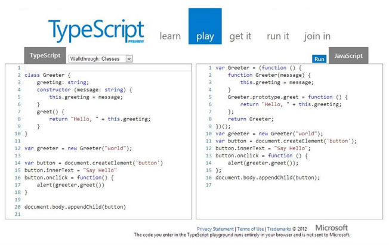
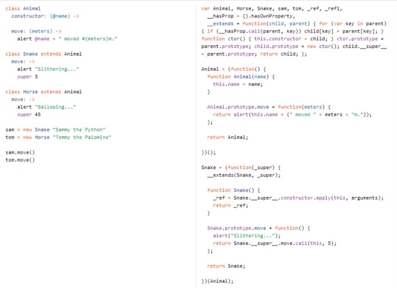

​TypeScript is the new flagship language from Microsoft that compiles into JavasScript.
<ul><li>
      Use JavaScript if you’re writing page specific script</li><li>
      Use jQuery to improve cross-browser support</li><li>
      Use TypeScript if you’re writing re-usable client side library</li></ul>
Don't use CoffeeScript (language is too different from JavaSript)

 <excerpt class='endintro'></excerpt> 
<dl class="goodImage"><dt> 
       
   </dt><dd>Figure: Good - TypeScript is very similar to JavaScript so it’s easy to learn, and also helps developers learn proper JavaScript coding practices</dd></dl>​
   <dl class="badImage"><dt> 
          
      </dt><dd>Figure: Bad – CoffeeScript syntax is very different from JavaScript so it takes longer to learn</dd> ​</dl>

