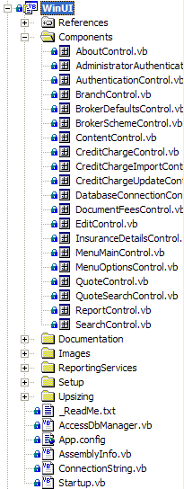
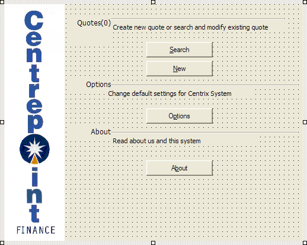
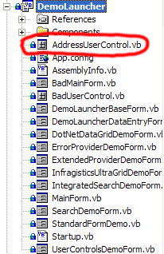
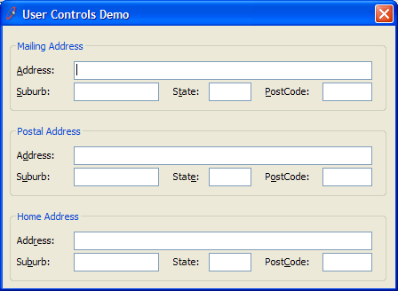
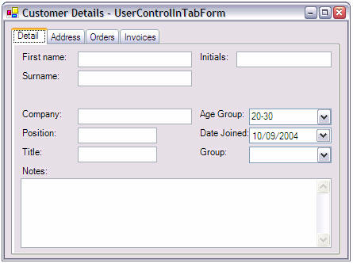

User controls allow you to have groups of elements which can be placed on forms.

<!--endintro-->

❌ **Bad**: User controls can be really misused and placed in forms where they shouldn't be. An example of that is shown below, under the components directory the user controls placed and used only *once* at a time during the application flow. There is much more coding responsibility on the developer to load those controls correctly one at a time inside the main form.

::: bad

:::

::: bad

:::

✅ **Good**: User Controls are best used for recurring or shared logic either on the same form or throughout the application. This encourages code reuse, resulting in less overall development time (especially in maintenance). Example, the figure below shows the good use of User Controls, the address control is repeated three times but coded once.

::: good

:::

::: good

:::

**Exception**: User controls can be made for tab pages (e.g Tools | Options) and search pages. This allows the breakdown of complex forms, and development by different developers. 

::: ok

:::

### Summary

✅ The pros of User Controls are:

* You can use a user control more than once on the same form eg. Mailing Address, Billing Address
* You can reuse logic in the code behind the controls e.g. Search control
* User controls are less prone to visual inheritance errors
* When used in a form with multiple tab pages - and each tab page potentially having a lot of controls, it is possible to put each tabpage into a separate user control
* Reduce lines of generated code in the designer by splitting it into multiple files
* Allow multiple persons to work on different complex tabpages

❌ However the cons are:

* You lose the **AcceptButton** and **CancelButton** properties from the Designer eg. OK, Cancel, Apply. Therefore the OK, Cancel and Apply buttons cannot be on User Controls
