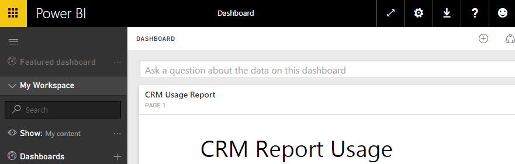

​
You can save report under My Workspace and share it with your team. This is bad because if you leave your company, your report is gone!

It's better to save reports under Group Workspace and share it with the team.​

 <excerpt class='endintro'></excerpt> 
<dl class="badImage"><dt> </dt><dd>Figure: Bad example - saving report under My Workspace</dd></dl><dl class="goodImage"><dt></dt><dd>Figure: Good example - saving report under Group Workspace</dd></dl><ol><li>Group work space requires all users to have pro license ($10 / month)</li><li>Group work space cannot share report and dashboard via embed link</li><li>Until  Microsoft fixes PowerBI's group sharing, it's better to use My Workspace with a shared account (i.e. <b>powerbi@ssw.com.au </b> )</li></ol>

