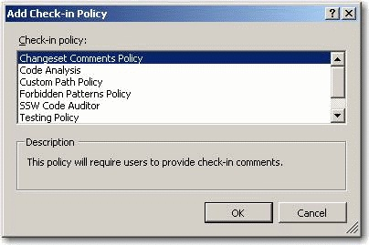

Check-in policies are a great tool to enforce quality code before it hits your source control repository. SSW recommends that the following check-in policies be enabled by default on your project:

<!--endintro-->

1. Changeset Comments Policy - To enforce that all check-in contain comments
2. SSW Code Auditor - To enforce coding standards and best practices before check-in
3. Testing Policy - To enforce that unit tests should all pass before code can be checked-in
4. Code Analysis Policy – To enforce that code analysis rules are not broken
5. Builds Policy – To enforce that the developer has built the project end to end before they check-in

**More Information**

To enable these policies:

1. Right click the  **Team Project in Team Explorer &gt; Team Project Settings &gt; Source Control**
2. Select the check-in policies above
3. Click  **OK**

 Figure: Chose check-in policies in TFS
