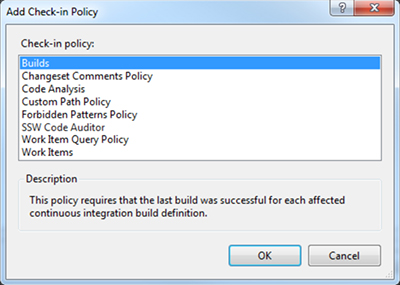

Check-in policies are a great way to enforce code quality before it hits your source control repository. SSW recommends that the following check-in policies be enabled by default on your project:

1. Changeset Comments Policy - To enforce that all check-in contain comments
2. SSW Code Auditor - To enforce coding standards and best practices before check-in
3. Work Items – To ensure check-ins are linked to a Work Item in TFS

<!--endintro-->

To enable these policies:

1. Click Settings in the Team Explorer Home hub
2. Click Source Control in the Team Project section (not Team Project Collection)
3. Open the Check-in Policy tab
4. Click Add... and select the check-in policies above. If you don’t have SSW Code Auditor installed, [download it](https://www.ssw.com.au/ssw/codeauditor/) here.add

<dl class="image">&lt;dt&gt;  &lt;/dt&gt;<dd>Figure: Choose check-in policies in TFS</dd></dl>
