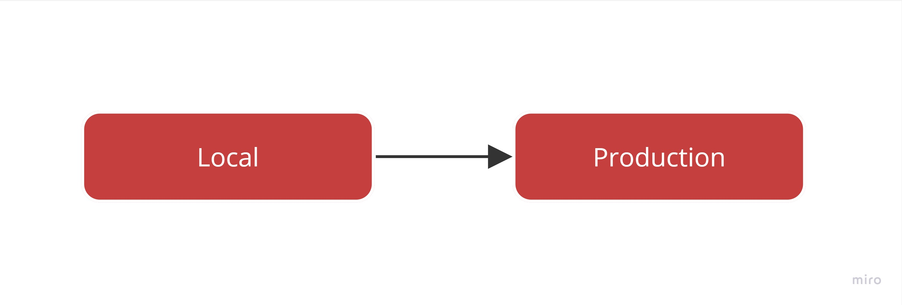
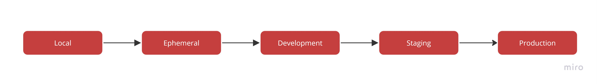

Before any project can be used by a customer it must first be published to a production environment.  However, in order to provide a robust and uninterrupted service to customers, it is important that the production environment is not used for development or testing purposes.  To ensure this, we must setup a separate environment for each of these purposes.

::: bad

:::

Skipping environments in a feeble attempt to save money will result in untested features breaking production.

## What is each environment for?

* **Production**: Real data being used by real customers. This is the baseline/high watermark of all your environments. Lower environments will be lower spec, fewer redundancies, less frequent backups, etc. 
* **Staging**: 'Production-like' environment used for final sign-off. Used for testing and verification before deploying to Production. Should be as close to Production as possible e.g. access (avoid giving - developers admin rights), same specs as production (especially during performance testing). However, this is not always the case due to cost implications.  It is important that staging is 'logically equivalent' to production.  This means having the same level of redundancy (e.g. Regions + Zones), back-ups, permissions, and service SLAs.
* **Development**: A place to verify code changes. Typically, simpler or under-specified version of Staging or Production environments aiding in the early identification and troubleshooting of issues (especially integration).
* **Ephemeral**: Short-lived environment that is spun up on demand for isolated testing of a branch, and then torn down when the branch is merged or deleted. See rule on [ephemeral environments](/ephemeral-environments).
* **Local**: Developer environment running on their local machine. May be self-contained or include hosted services depending on the project's needs.

## What environments should I create for a new project?

### Large or Multi-Team Projects

::: good

:::

For large projects it's recommended to run 4 hosted environments + 1 local:

* Production
* Staging
* Development
* Ephemeral (if possible)
* Local

The above is a general recommendation.  Depending on your project's needs you may need to add additional environments e.g. support, training, etc.

### Internal or Small Projects

::: good

:::

For smaller projects we can often get away without having a dedicated development environment. In this scenario we have 2 hosted environments + 1 local:

* Production
* Staging
* Local
