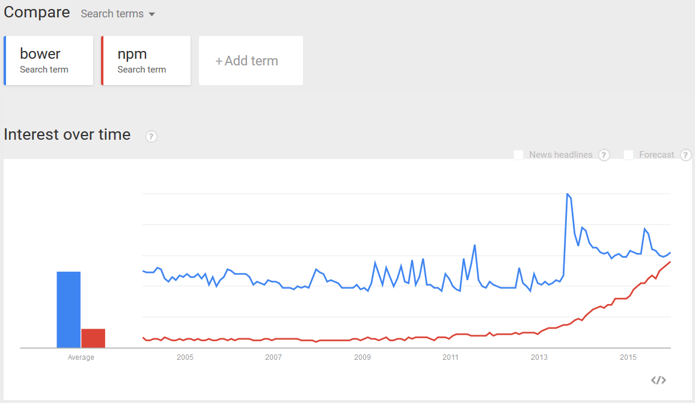

​​​When you create a new MVC project in Visual Studio it is important to include the right packages from the start. This makes the project more manageable and you become more efficient in producing your final result. 
 <excerpt class='endintro'></excerpt> 

​If you add old, obsolete or incorrect NuGet packages, the project will suffer and you might have decreased performance or scope creep as new requirements are discovered. 

Avoid old technologies such as:
<ul><li> MVC W​​​​eb Forms</li><li> KnockoutJS</li></ul>
   
When ​you create a project you should be adding the following NuGet Packages:  
<ul><li>SSW.DataOnion </li><li>SSW.HealthCheck​ </li><li>​​AutoFac</li><li>Seril​og​ </li></ul>
You should also add the following NPM  packages:
<ul><li>​Angular JS</li><li>​Bootstrap</li><li>Gulp </li></ul>
 
   <strong>Note</strong>: Prior to 2016, SSW recommend developers choose bower over NPM as their front end package manager. That recomendation has chan​ged due to the industry trend away from bower.

 
    
<dd class="ssw15-rteElement-FigureGood">Figure: NPM Popularity has been increasing </dd>
Part of 
   
      <a href="https://sugarlearning.com/companies/SSW/modules/5099/induction-day-3-developer-induction" target="_blank">SugarLearning Developer Induction</a>. 
    

