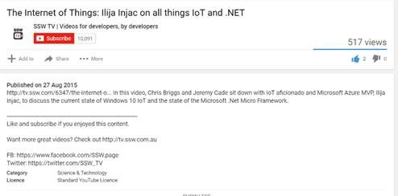

When you upload a video, what is the most important step for the videos future success or failure?

The most important step is setting the right title and description. As this is what search engines index to help others find your video content.

<!--endintro-->

::: ok  
  
:::

The keywords for the video above are:

* Windows 10
* IoT
* Microsoft
* .NET
* Micro Framework

However, it is missing important keywords such as:

* open source
* C#
* GitHub
* Universal Windows Platform
* Raspberry Pi
* I2C

How to capture all of these missing keywords?  You can't just overload your content with keywords, as your content will quickly become flagged as spam.

The answer is to have your video content transcribed. As it provides drastically benefits for the discoverability of your video content, while the organic nature of the written material ensures it is not flagged as spam.

::: ok  
  
:::

A quick Google search will show a range of services which will make the task effortless. However, professional transcriptions are expensive. If you’re willing to spend a little time cleaning up technical jargon then it is worth checking out  **fiverr** (https://www.fiverr.com/categories/writing-translation/transcription).

At SSW we have had success with this method as one of our devs, Chris Briggs transcribed all 3 hours of his  **SSW TV** video content for under $90 USD and an hour and a half of his time to fix up jargon.
