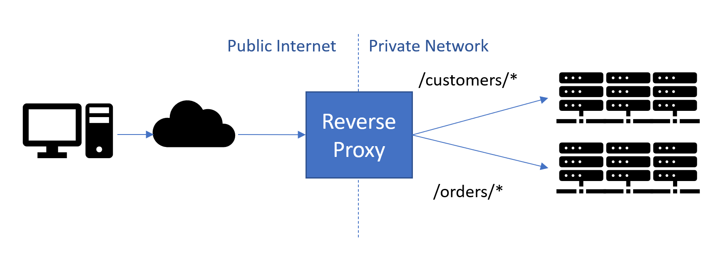

YARP, or Yet Another Reverse Proxy, is a .NET toolkit designed for building fast proxy servers. It seamlessly integrates with ASP.NET and .NET infrastructure, offering easy customization to suit specific deployment needs. YARP operates within the ASP.NET pipeline, handling incoming requests and utilizing its sub-pipeline for proxying requests to backend servers. Users can extend functionality by adding or replacing modules as required. 
YARP uses the concept of **Routes** to represent request patterns for the proxy and **Clusters** to represent the services to forward those requests.

**Figure: YARP is a reverse proxy that acts as the public endpoint for a site or service and forwards calls to backend servers.**
**Source: [Announcing YARP 1.0 Release](https://devblogs.microsoft.com/dotnet/announcing-yarp-1-0-release/)**
<!--endintro-->
### Advantages of YARP:
Numerous API gateways and reverse proxy implementations, including [NGINX](https://www.nginx.com/) and [Ocelot](https://github.com/ThreeMammals/Ocelot), are already available for use. However, YARP distinguishes itself with its unique attributes. YARP seamlessly integrates into the ASP.NET environment, offering effortless customization to meet specific requirements. YARP offers a comprehensive set of features for building and managing reverse proxy solutions, including:
- **Dynamic route definitions:** Enables the definition of routes in a dynamic configuration, allowing flexibility in specifying how incoming requests are handled.
- **Extensible pipeline model:** Customize the proxy behavior using a modular pipeline architecture.
- **Load balancing:** Employ various load-balancing algorithms to distribute traffic effectively.
- **Session Affinity:** Ensures that requests from a specific client are consistently directed to the same destination server, promoting continuity and predictability in the user experience.
- **Request and response transformation:** Allows developers to apply transformations to requests sent to or responses received from destination servers. This feature facilitates the customization of data before it reaches its destination.
- **Route-level authorization and CORS:** Permits the specification of authorization and Cross-Origin Resource Sharing (CORS) settings on a per-route basis. This ensures fine-grained control over access and security policies for different routes.