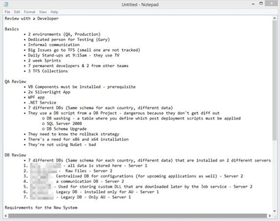
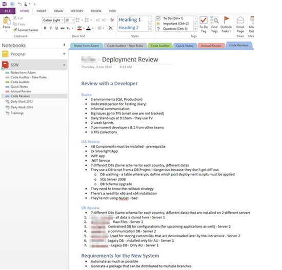
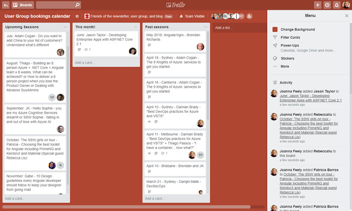

During meetings, there is a lot of communication between you and the client. It is very hard to keep the entire conversation in your head; hence it is very important you take notes. Notes must be short but descriptive enough so that you can remember what the conversation was all about and what tasks were created during the meeting. It is also very important that you use appropriate tools e.g. Microsoft OneNote, Trello, Microsoft Word, Notepad++ and avoid tools like Notepad.

<!--endintro-->
 The best tool for taking notes will depend on what sort of activity you are doing. If you are making a straightforward document, OneNote will suffice. However, if the activity involves creating a lot of new tasks, it might be worth using Trello to take your notes. Trello allows for the creation of multiple lists (such as "To do", "In progress", and "Done") and has an easy drop and drag interface to reorganise work items as required. It also allows for comments on any item created, and you can tag people so they are associated with items. That way each new task can be created, organised and assigned immediately. You can invite team members and clients to the board so everyone is on the same page with regard to progress and outcomes. <dl class="badImage">&lt;dt&gt;   
   &lt;/dt&gt;&lt;dt&gt;    
   &lt;/dt&gt;<dd>Figure: Bad example – Notepad is not a good tool as it cannot recover your content in case of disaster</dd></dl><dl class="goodImage">&lt;dt&gt;    
   &lt;/dt&gt;<dd>Figure: Good example – Notes from the meeting with a client were written in OneNote  </dd></dl><dl class="goodImage">&lt;dt&gt;  &lt;/dt&gt;<dd>Figure: Good example – Notes from a conversation organising presenters for upcoming user groups. The sessions are listed in month order and the speakers have been tagged in their respective events. </dd></dl>
