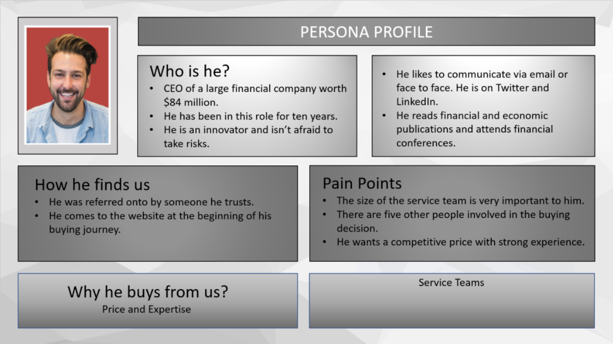

A buyer persona is, according to Hub​Spot, a semi-fictional representation of your ideal customer. It's based on market research, actual data about your existing customers, and a few (educated) assumptions. It helps you to understand and relate to an audience that you want to market your products and services to. ​ 

 <excerpt class='endintro'></excerpt> 

​When creating your buyer persona, you should include customer demographics, behaviour​​ patterns, motivations, and goals. The more specific you can be, the better. Variations of your buyer persona would also help understand and shape strategy and communication to sell your service/product, for example: "Can only men purchase my product? Or women too? Or maybe children eventually? How old can they be? Are they only local? Can I consider selling it to other states?" 
<dl class="image"><dt></dt><dd>Figure: Example of questions you need to answer in order to identify your buyer persona​ </dd></dl>

