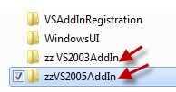
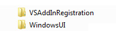

Keeping your projects tidy says good things about the teams maturity. Therefore any files and folders that are prefixed with zz, must be deleted from the project.

<!--endintro-->
<dl class="badImage">&lt;dt&gt; 
       
   &lt;/dt&gt;<dd>Figure: Bad example - Zz-ed files should not exist in Source Control</dd></dl><dl class="goodImage">&lt;dt&gt;
      
   &lt;/dt&gt;<dd>Figure: Good example - No zz-ed files in Source Control</dd></dl>
