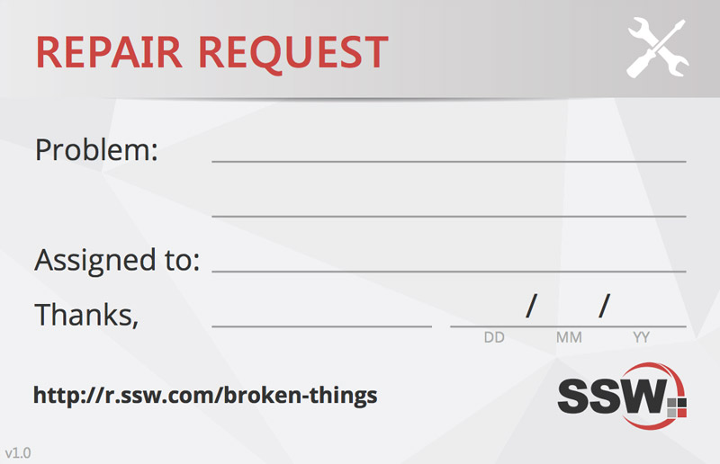

Imagine you see one port of a hub not working, what do you do?

When you see something not working like a phone or a power point, don't ignore it, stick a note to it and tell the appropriate person.

<!--endintro-->

Create a form that reminds you what is broken, who you have to call to fix it and any notes that may need to ensure that the item in question is fixed properly or replaced.

::: good\
\
:::

If you want to have a more formal version of the sticky note, the SSW Design Team has created  [this PDF](https://github.com/SSWConsulting/SSW.Rules.Content/raw/main/rules/do-you-label-broken-equipment/SSW-label-broken-things.pdf) which can be printed and attached to stuff that needs fixing (however, normally just a yellow sticky note and an email does the job just fine) 

::: good\
\
:::