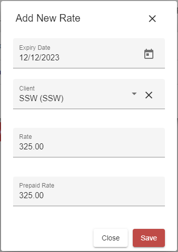

Consistency is a key factor of software development, designing applications that minimise the learning curve through consistent use of components and functionality. If buttons with similar functionality are named inconsistently across an web application, it can cause a confusing experience for its users. For example, the buttons used to close a form should be named consistently across your app.

Additionally, buttons should have clear names so the user knows what to expect. For example, it is unclear if a button named "close" will save (or not save) when closing, so "cancel" would be clearer.

<!--endintro-->

::: bad  
  
:::

* **Save** button alone is not explicit about the following action for the form (It could close or remain open)
* **Close** could save the fields, then close the form, when the **Cancel** button may be more appropriate.

We recommend the web standards of:

* **Save** - Save data without closing the form.
* **Save and Close** - Close the form and save any changed data.
* **Cancel**  - Close the form without saving.

::: good  
  
:::

We have a program called     [SSW Code Auditor](http://www.ssw.com.au/ssw/CodeAuditor/) to check for this rule.
