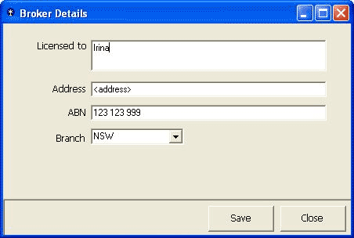
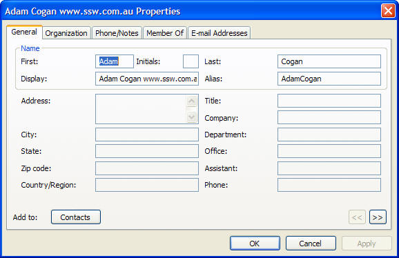

​The buttons that a user will typically use to close a form should be named consistently across your applications.

 <excerpt class='endintro'></excerpt> 
<dl class="badImage"><dt>
      
   </dt><dd>Figure: Bad Example - Unclear labels on the buttons</dd></dl><ul><li>
      <strong>Save</strong> button could possibly update the fields but keep the form open.</li><li>
      <strong>Close</strong> could save the fields, then close the form, when the 
      <strong> Cancel</strong> button may be more appropriate.</li></ul>
We recommend the age-old standards of:
<ul><li>
      <strong>OK</strong>. Close the form and save any changed data. This should be referenced by the form's AcceptButton property.</li><li>
      <strong>Cancel</strong>. Close the form without saving. This should be referenced by the form's CancelButton property.</li><li>
      <strong>Apply</strong>. Save data without closing the form.</li></ul><dl class="goodImage"><dt>
      
   </dt><dd>Figure: Good Example - This form uses the standard button naming standards (and has the Default buttons set!)</dd></dl>
We have a program called 
   <a href="http://www.ssw.com.au/ssw/CodeAuditor/">SSW Code Auditor</a> to check for this rule.

