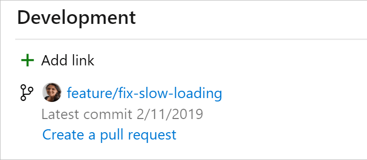
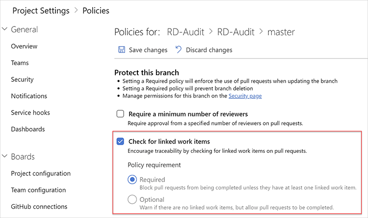

To improve visibility into what work has been done, link your PBIs and tasks to the related commits, branches, and pull requests. **Every commit, branch, and PR should be associated with a PBI.**

<!--endintro-->

::: bad  
  
:::

::: good  
  
:::

## Using Azure DevOps

If you create branches through Azure DevOps, you can link them to a work item during the creation process.

::: good  
  
:::

Learn more on this article: [Linking Work Items to Git Branches, Commits, and Pull Requests](https://devblogs.microsoft.com/devops/linking-work-items-to-git-branches-commits-and-pull-requests?WT.mc_id=DOP-MVP-33518).

## Automating rule enforcement

You can [setup Branch Policies](https://learn.microsoft.com/en-us/azure/devops/repos/git/branch-policies?WT.mc_id=DOP-MVP-33518) on your main branches to enforce this behaviour.

::: good  
  
:::
