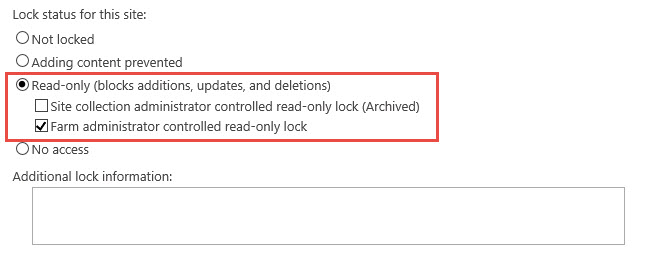
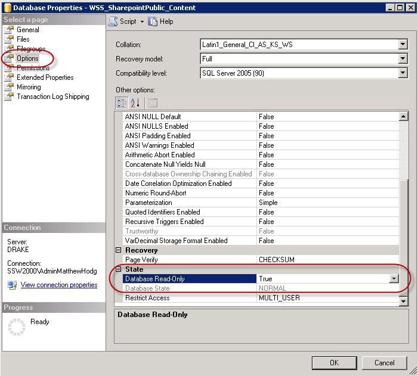

Even though you have advised staff members a migration is taking place – you can guarantee someone will try to check-in or edit documents. The best way to prevent this is to put your content database into read-only mode, locking the content database.
 <excerpt class='endintro'></excerpt> 

​There are two options to lock the content database.

   Option 1 (<strong>Recommended</strong>): ​​ 
    

1.  Open <strong>SharePoint Central Administration</strong> site, navigate to "<strong style="color:#2a2a2a;font-family:'segoe ui', 'lucida grande', verdana, arial, helvetica, sans-serif;line-height:18px;">Application Management</strong>" | "<strong style="color:#2a2a2a;font-family:'segoe ui', 'lucida grande', verdana, arial, helvetica, sans-serif;line-height:18px;">Site Collections</strong>" | "<strong>Configure quotas and locks</strong>".
<dl class="ssw15-rteElement-ImageArea">
   
</dl>

   2. Select the "site collection" which you would like to lock.

   ​3. Choose "Read-only (blocks additions, updates, and deletions)", then click "OK".
<dl class="ssw15-rteElement-ImageArea">
   
<dd>Note: Read more at <a href="https://technet.microsoft.com/en-us/library/cc263238%28v=office.15%29.aspx?f=255&MSPPError=-2147217396">Manage the lock status for site collections in SharePoint 2013</a></dd>
​​</dl>
Option 2 (<strong>not recommended</strong>):

1.    On your database server open 
   <b>SQL Server Management Studio</b>

2.    Right click on the content database associated with the site collection you're migrating | 
   <b style="line-height:1.6;">Properties</b>

3.    Choose 
   <b>Options </b>| Scroll to the bottom of the options list

4.    For the 
   <b>Database Read-Only</b> choose True
<dl class="image"><dt>
      
   </dt><dd>Figure - Database Properties | Options | Database-Read Only</dd></dl> ​ 

5.    Now it’s safe to take a backup of your content database

 <b>NOTE: </b> When some SharePoint timer services are run it may cause the site to display errors when the database is in read-only mode

