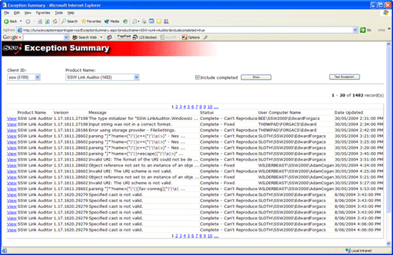

All unhandled exceptions should be logged to provide developers with sufficient information to fix bugs when they occur. There are two options we for logging exceptions:

<!--endintro-->

The Microsoft **Exception Management Application Block**Microsoft provides full source code for the EMAB, which is fully extensible with custom logging target extensions. We decided to customize the EMAB to produce the SSW Exception Management Block, which logs exceptions to a database using a web service, allowing us to keep a history of all exceptions.

Your code should not contain any empty catch blocks as this can hamper exception handling and debugging.

We have a program called [SSW Code Auditor](https://ssw.com.au/ssw/CodeAuditor/) to check for this rule.

We have a program called [SSW .NET Toolkit](https://ssw.com.au/ssw/NETToolkit/) that implements Exception Logging and Handling
