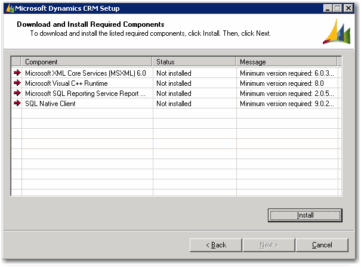

As per rule <a href="/installation-do-you-log-each-screen-which-is-different-to-the-default" style="color:purple;line-height:16.79px;font-family:verdana, sans-serif;font-size:12px;">Installation - Do you log each screen which is different to the default?</a>, it's important that you log each screen so that you can have a historical log of the upgrading.

 <excerpt class='endintro'></excerpt> 

​
<dt style="border:currentcolor;color:#000000;line-height:17px;font-family:verdana, sans-serif;font-size:12px;"></dt><dd style="border:currentcolor;color:#000000;line-height:17px;font-family:verdana, sans-serif;">Figure: Log Screen For Required Components</dd>

