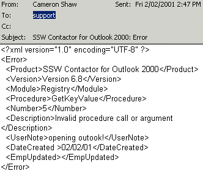

  
When you walk into a clothes store to exchange a pair of jeans, you expect to be treated with respect. The sales person should talk to you at your level, deal with your issues, and in a polite and fair way handle your problem. Developers should not expect software users to be treated any differently​. 

Every error message you put into your products is an opportunity for good service. Users don't want to see "Run-time error. Can't save record with zero length string", instead the User should receive a message that helps them through the situation.

 <excerpt class='endintro'></excerpt> 

  

     

Figure: Log every error

Not to say though that there is any ideal error message - a great error is one that has been eliminated! In packaged products, every unhandled error is our problem. 

In the old days, unhandled errors would be stored in a local Access db, but now all unhandled errors should be automatically emailed to the product team. This is a proactive and polite approach to dealing with unhandled errors. If it's serious we will contact the client to resolve the situation - they get a bit of a surprise and think we have ESP! 

Remember what it is like to have good service in a restaurant. A good waiter knows when to interrupt you, when to leave you alone and how to do it all in a courteous and respectful way.

