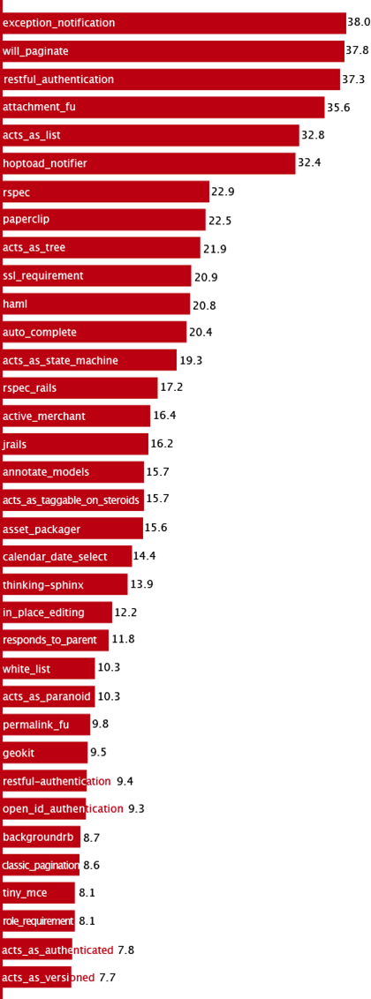
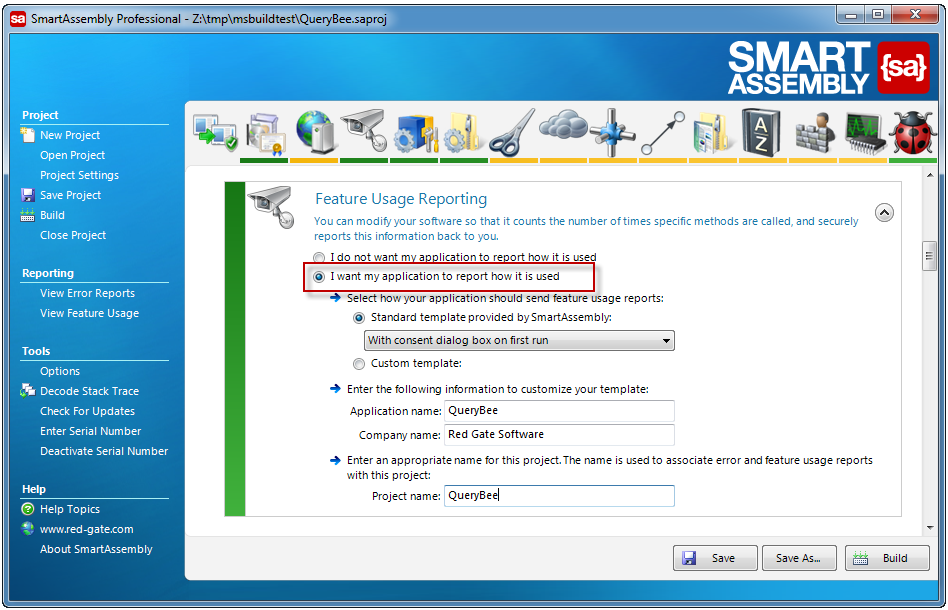
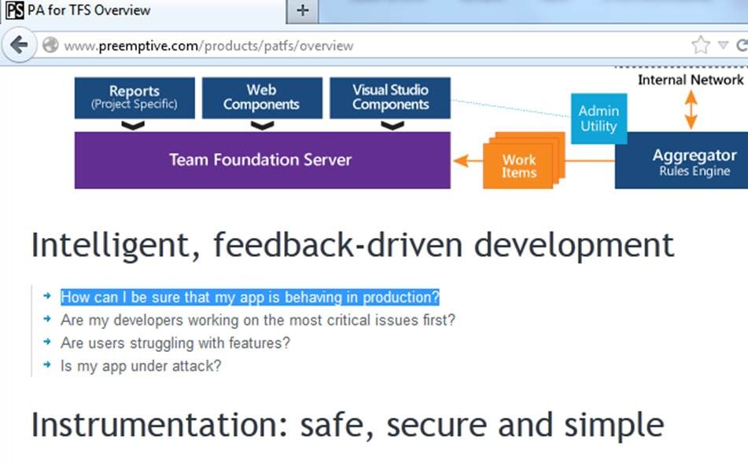

So you can see what functions are being used more often (e.g. reports, menu items).​ 

 <excerpt class='endintro'></excerpt> 
​Plus, you can work out what fields to show on search pages (standard and advanced tabs) and which parameters are being used.
<dl class="image"><dt> </dt> <dd>Figure: Keep track of what terms are searched most often </dd></dl>

You can achieve this with Redgate's <a href="http://www.red-gate.com/products/dotnet-development/smartassembly/" target="_blank">Feature Usage Reporting</a>. <dl class="ssw15-rteElement-ImageArea"></dl><dd class="ssw15-rteElement-FigureNormal">Figure: Smart Assembly Professional keeps tracks of usage </dd><dl class="ssw15-rteElement-ImageArea"></dl><dd class="ssw15-rteElement-FigureNormal">Figure: PA for TFS </dd>

