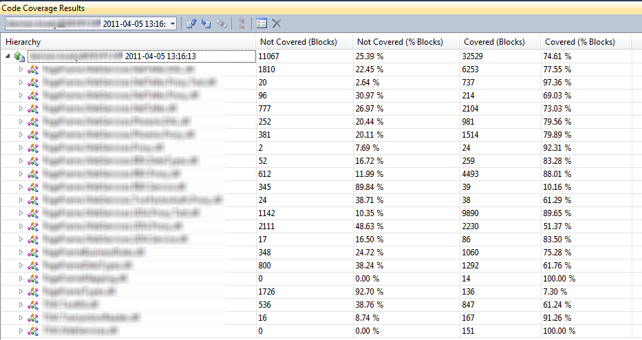

Code Coverage shows how much of your code is covered by tests and can be a useful tool for showing how effective your unit testing strategy is. However, it should be looked at with caution.

<!--endintro-->

* You should focus more on the **quality** and less on the **quantity** of tests
* You should write tests for fragile code first and not waste time testing trivial methods
* Remember the 80-20 rule - very high test coverage is a noble goal, but there are diminishing returns
* If you're modifying code, write the test first, then change the code, then run the test to make sure it passes (aka [red-green-refactor](/make-sure-that-the-test-can-be-failed)).   
   **Tip**: This is made very easy by the "Live Unit Testing" feature in Visual Studio - see [Do you use Live Unit Testing to see code coverage?](/use-live-unit-testing-to-see-code-coverage)
* You should run your tests regularly (see [Do you follow a Test Driven Process?](/before-starting-do-you-follow-a-test-driven-process)) and, ideally, the tests will be part of your deployment pipeline

  

::: greybox
**Tip:** To make sure your unit test coverage never decreases, make use of tools such as [SonarQube](https://www.sonarsource.com/products/sonarqube/) and [GitHub action checks](https://github.com/marketplace/actions/code-coverage-summary) to gate your deployment pipelines on non-decreasing test coverage.
:::
