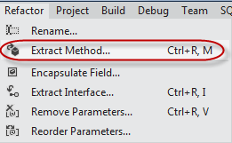

Code duplication is a big "code smell" that harms maintainability.  You should keep an eye out for repeated code and make sure you refactor it into a single place.

<!--endintro-->

For example, have a look at these two Action methods in an MVC 4 controller.

```
//
// GET: /Person/
[Authorize]
public ActionResult Index()
{
    // get company this user can view
    Company company = null;
    var currentUser = Session["CurrentUser"] as User;
    if (currentUser != null)
    {
        company = currentUser.Company;
    }

    // show people in that company
    if (company != null)
    {
        var people = db.People.Where(p => p.Company == company);
        return View(people);
    }
    else
    {
        return View(new List());
    }
}

//
// GET: /Person/Details/5
[Authorize]
public ActionResult Details(int id = 0)
{
    // get company this user can view
    Company company = null;
    var currentUser = Session["CurrentUser"] as User;
    if (currentUser != null)
    {
        company = currentUser.Company;
    }

    // get matching person
    Person person = db.People.Find(id);
    if (person == null || person.Company == company)
    {
        return HttpNotFound();
    }
    return View(person);
}
```
::: bad
Figure: Bad Example - The highlighted code is repeated and represents a potential maintenance issue.
:::

We can refactor this code to make sure the repeated lines are only in one place.

```
private Company GetCurrentUserCompany()
{
    // get company this user can view
    Company company = null;
    var currentUser = Session["CurrentUser"] as User;
    if (currentUser != null)
    {
        company = currentUser.Company;
    }
    return company;
}

//
// GET: /Person/
[Authorize]
public ActionResult Index()
{
    // get company this user can view
    Company company = GetCurrentUserCompany();

    // show people in that company
    if (company != null)
    {
        var people = db.People.Where(p => p.Company == company);
        return View(people);
    }
    else
    {
        return View(new List());
    }
}


// GET: /Person/Details/5
[Authorize]
public ActionResult Details(int id = 0)
{
    // get company this user can view
    Company company = GetCurrentUserCompany();

    // get matching person
    Person person = db.People.Find(id);
    if (person == null || person.Company == company)
    {
        return HttpNotFound();
    }
    return View(person);
}
```
::: good
Figure: Good Example - The repeated code has been refactored into its own method.
:::

**Tip:** The Refactor menu in Visual Studio 11 can do this refactoring for you.

