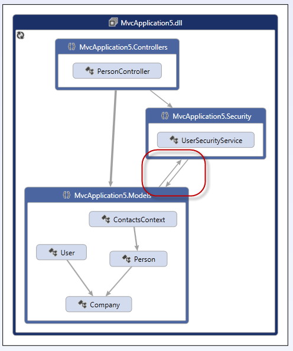
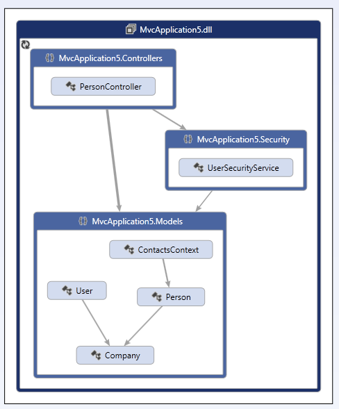

GRASP stands for General Responsibility Assignment Software Patterns and describes guidelines for working out what objects are responsible for what areas of the application.

 <excerpt class='endintro'></excerpt> 

​The fundamentals of GRASP are the building blocks of Object-​Oriented design.  It is important that responsibilities in your application are assigned predictably and sensibly to achieve maximum extensibility and maintainability.

GRASP consists of a set of patterns and principles that describe different ways of constructing relationships between classes and objects.

<table cellpadding="4" border="1" style="border-collapse:collapse;">
<tbody><tr><th>Creator</th>
<td>A specific class is responsible for creating instances of specific other classes (e.g. a Factory Pattern)</td></tr>
<tr><th>​Information Expert</th>
<td>Responsibilities are delegated to the class that holds the information required to handle that responsibility​</td></tr>
<tr><th>​Controller</th>
<td>​System events are handled by a single "controller" class that delegates to other objects the work that needs to be done</td></tr>
<tr><th>​Low Coupling </th>
<td>Classes should have a low dependency on each other, have low impact if changed, and ​have high potential for reuse</td></tr>
<tr><th>​High Cohesion</th>
<td>​Objects should be created for a single set of focused responsibilities</td></tr>
<tr><th>​Polymorphism</th>
<td>​The variation in behaviour of a type of object is the responsibility of that type's implementation</td></tr>
<tr><th>​Pure Fabrication</th>
<td>​Any class that does not represent a concept in the problem domain</td></tr>
<tr><th>​Indirection</th>
<td>​The responsibility of mediation between two classes is handled by an intermediate object (e.g. a Controller in the MVC pattern)</td></tr>
<tr><th style="padding-right:10px;">​Protected Variations</th>
<td>​Variations in the behaviour of other objects is abstracted away from the dependent object by means of an interface and polymorphism</td></tr></tbody></table>

Tip: Visual Studio's Architecture tools can help you visualise your dependencies.  A good structure will show calls flowing in one direction.

Figure: Bad Example - Calls are going in both directions which hints at a poor architecture

Figure: Good Example - Calls are flowing in one direction hinting at a more sensible arrangement of responsibilities

