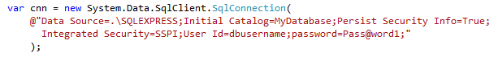
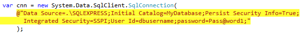
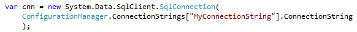

Long hard-coded strings in a codebase can be a sign of poor architecture.

 <excerpt class='endintro'></excerpt> 

​To make hard-coded strings easier to find, <a href="/do-you-highlight-strings-in-your-code-editor">consider highlighting them in your IDE</a>.

 
Figure: Bad Example - The connection string is hard-coded and isn't easy to see in the IDE.

Figure: Better Example - The connection string is still hard-coded, but at least it's very visible to the developers.

Figure: Good Example - The connection string is now stored in configuration and we don't have a long hard-coded string in the code.

