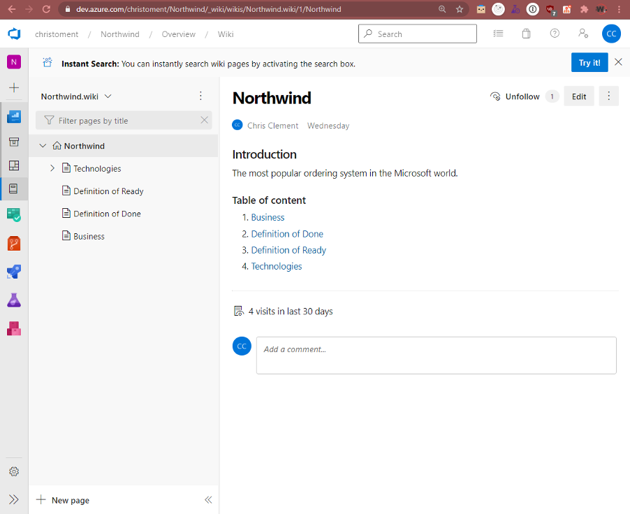

There are a few styles of documentation:

<!--endintro-->

### Bad Example – Old School
<dl class="badImage">&lt;dt&gt; 
       
   &lt;/dt&gt;<dd>Figure: Bad example - The dinosaur’s method of documentation </dd></dl>
The old school way is document first – lots of planning, and lots of heavy documentation created upfront before even a single line of code is written.

This is the method most familiar to teams who are comfortable with Waterfall and have possibly never heard of Agile. Documentation can normally be characterized by:

* Heavy, long documents
* Sequence Diagrams
* UML

This is a well-established way to do documentation, but it has several problems:

* Gets out of date quickly
* High maintenance overhead
* Needs a business analyst

<dl class="badImage">&lt;dt&gt;
      
   &lt;/dt&gt;<dd>Figure: Bad example - Documentation can take the form of Sequence Diagrams</dd></dl><dl class="badImage">&lt;dt&gt;
      
   &lt;/dt&gt;<dd>Figure: Bad example - Use Case Diagrams are even worse!</dd></dl>
There may be exceptions – some situations benefit from this kind of documentation; for example, it may be necessary to support a business case – although a well-defined spec is a better document to support a business case.

::: greybox
**More info:** https://rules.ssw.com.au/rules-to-better-specification-reviews

:::

**Tip:** Documentation should be as minimal as possible. If your circumstances require this style of documentation, start by limiting it to just enough to cover your first couple of Sprints. And recognize that by going down this path you make a commitment to keeping it up-to-date.

### Good example – The 7 Important Documents

This style of documentation is used by modern teams who are Agile only.

There are 7 crucial documents for your project:

**In the repository (for developers):**

**1. README.md** – Explains the overview of the project and provides links to the rest of the documentation.

**2. docs\Instructions-Compile.md** – Instructions on how to build and run the project (AKA the F5 experience).

**3. docs\Instructions-Deployment.md** – Explains how to deploy the solution, including any additional processes (e.g. DevOps)

Keeping these documents in the repository means that you ensure that any documentation the developers need to work on or run the code is where they need it - with the code.

It also means that when a developer makes a change to the code that needs an update to the documentation, the documentation changes can be checked in along with the code in the same commit.

**In the Wiki (for developers and other stakeholders):**

::: greybox
**Note:** When using a GitHub Wiki, it’s a separate repository. When using an Azure DevOps Wiki, it’s in the same repository.
:::

**4. Wiki\Business** – explains the purpose of the application, including the problem, goals, and statement of intent.

**5. Wiki\Technologies-and-Architecture** – Provides a technical overview of the solution, including any 3rd party libraries or utilities, patterns followed (e.g.        [https://rules.ssw.com.au/rules-to-better-clean-architecture](/_layouts/15/FIXUPREDIRECT.ASPX?WebId=3dfc0e07-e23a-4cbb-aac2-e778b71166a2&TermSetId=07da3ddf-0924-4cd2-a6d4-a4809ae20160&TermId=b3a8b0b0-6439-4d24-9b9c-9561bc749d0c)), architecture decisions, etc. This document should cover software architecture and cloud architecture (or on-premises if you’re a dinosaur 🦕), and should \*always\* have a system architecture diagram (see:        [https://rules.ssw.com.au/have-an-architecture-diagram](/_layouts/15/FIXUPREDIRECT.ASPX?WebId=3dfc0e07-e23a-4cbb-aac2-e778b71166a2&TermSetId=07da3ddf-0924-4cd2-a6d4-a4809ae20160&TermId=7b588070-e0d2-46f4-811e-87b15a8c190d)), as well as an Azure resources diagram, see: [https://rules.ssw.com.au/azure-resources-diagram/](/_layouts/15/FIXUPREDIRECT.ASPX?WebId=3dfc0e07-e23a-4cbb-aac2-e778b71166a2&TermSetId=07da3ddf-0924-4cd2-a6d4-a4809ae20160&TermId=d494984e-5089-43e2-bc4d-917fd9248148)

**6. Wiki\Definition-of-Done** - Ensures that your team [maintains a high level of quality with a Definition of Done](/_layouts/15/FIXUPREDIRECT.ASPX?WebId=3dfc0e07-e23a-4cbb-aac2-e778b71166a2&TermSetId=07da3ddf-0924-4cd2-a6d4-a4809ae20160&TermId=6449ae79-ba88-447e-aa48-36173029a2af)

**7. Wiki\Definition-of-Ready** – Ensures that all your PBIs are well defined to an agreed standard before adding them to a sprint (see:        [https://rules.ssw.com.au/have-a-definition-of-ready](/_layouts/15/FIXUPREDIRECT.ASPX?WebId=3dfc0e07-e23a-4cbb-aac2-e778b71166a2&TermSetId=07da3ddf-0924-4cd2-a6d4-a4809ae20160&TermId=e01abde1-9a3e-4e4c-84a8-50e98e9c44d0))

Documents to be read or edited by the Product Owner (or other members of the Scrum team) are better kept out of the code repository, in the Wiki. The advantages of this approach are:

* Updating the Wiki does not trigger the CI/CD pipeline
* The writing experience in the Wiki is more friendly for non-developers (no need to clone the repo and submit a pull request; especially annoying for a minor change)

::: greybox
**Tip** : All of your documents (in your Wiki and your repository) should be written in Markdown (see:     [https://rules.ssw.com.au/using-markdown-to-store-your-content](/_layouts/15/FIXUPREDIRECT.ASPX?WebId=3dfc0e07-e23a-4cbb-aac2-e778b71166a2&TermSetId=07da3ddf-0924-4cd2-a6d4-a4809ae20160&TermId=a7b84edd-3378-423c-b8b7-a8590b454f85))
:::

<dl class="badImage">&lt;dt&gt; 
          
           
      &lt;/dt&gt;<dd>Figure: Bad example - Github project without any documentation or instruction </dd></dl><dl class="badImage">&lt;dt&gt;
         
      &lt;/dt&gt;<dd>Figure: Bad example - Azure DevOps project without any documentation or instruction</dd></dl><dl class="image">&lt;dt&gt;
         
      &lt;/dt&gt;<dd>Figure: OK example - Github project with README instructions on how to compile and run the project (but still has a TODO)</dd></dl><dl class="goodImage">&lt;dt&gt; 
          
      &lt;/dt&gt;<dd>Figure: Good example - Azure DevOps project with README instructions on how to compile and run the project</dd></dl><dl class="goodImage">&lt;dt&gt; 
         
      &lt;/dt&gt;<dd>Figure: Good example - Github project with Wiki instructions for product owners, stakeholders, or public consumption (Source: <a href="https://github.com/christoment/Northwind/wiki">https://github.com/christoment/Northwind/wiki</a>)</dd></dl><dl class="goodImage">&lt;dt&gt;
         
      &lt;/dt&gt;<dd>Figure: Good example - Azure DevOps project with Wiki instructions for product owners, stakeholders, or public consumption </dd></dl>
**Tip:** Use your documentation for onboarding developers

<dl class="badImage">&lt;dt&gt; 
       
   &lt;/dt&gt;<dd>Figure: Bad Example - No documentation, go and sit with another developer </dd></dl><dl class="goodImage">&lt;dt&gt; 
       
   &lt;/dt&gt;<dd>Figure: Good example - Developer onboarding can be self-guided by good documentation, and offers a structure for feedback and improvement if the developer hits any issues</dd></dl>
**Tip:** Keep your documentation as minimal as possible - automate the F5 experience and deployment process (documents 2 and 3) using PowerShell scripts. Then your documents can just say "run these scripts"

### The rest of the jigsaw

::: greybox

**Scrum Tip: Update your Acceptance Criteria** - If you use a policy that requires commits to be linked to PBIs, then you understand that the PBI is now the documentation. If requirements change (based on a conversation with the Product Owner of course) then the PBI should be updated.

When updating the Acceptance Criteria,        ~~strike through~~ the altered Acceptance Criteria, and add the new ones. Get the PO to confirm your understanding.

E.g.
~~Enter search text, click ‘Google’, and see the results populate below.~~
[Updated]
Enter search text and automatically see the results populate below.

This should be added to the        [Definition of Done](/_layouts/15/FIXUPREDIRECT.ASPX?WebId=3dfc0e07-e23a-4cbb-aac2-e778b71166a2&TermSetId=07da3ddf-0924-4cd2-a6d4-a4809ae20160&TermId=6449ae79-ba88-447e-aa48-36173029a2af).

:::

**What's "Technical Debt"?**

During a project, when you add functionality, you have a choice:

One way is quick but messy - it will make further changes harder in the future (i.e. quick and dirty).

The other way is cleaner – it will make changes easier to do in the future but will take longer to put in place.

'Technical Debt' is a metaphor to help us think about this problem. In this metaphor (often mentioned during Scrum software projects), doing things the quick and dirty way gives us a 'technical debt', which will have to be fixed later. Like financial debt, the technical debt incurs interest payments - in the form of the extra effort that we must do in future development.

We can choose to continue paying the interest, or we can pay the debt in full by redoing the piece of work in a cleaner way.

The same principle is true with documentation. Using the 'old school' method will leave you with a build-up of documentation that you will need to keep up to date as the project evolves.

Warning: if you want to follow Scrum and have zero technical debt, then you must throw away all documentation at the end of each sprint. If you do want to keep it, make sure you add it to your [definition of done](/_layouts/15/FIXUPREDIRECT.ASPX?WebId=3dfc0e07-e23a-4cbb-aac2-e778b71166a2&TermSetId=07da3ddf-0924-4cd2-a6d4-a4809ae20160&TermId=6449ae79-ba88-447e-aa48-36173029a2af)to keep it updated.
