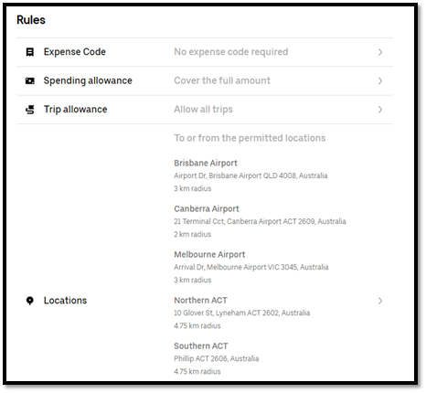
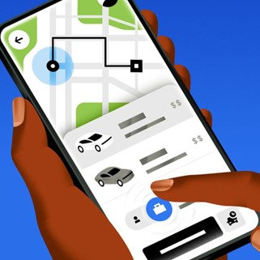

In our fast-paced work environment, it is crucial to get to client sites or attend meetings efficiently. However, managing the associated expenses can often be a time-consuming and challenging task.

When staff need to travel, they normally need to follow the company’s standards and keep physical or virtual records including approval or tax invoices. 

It may take 10 minutes to finish the paperwork and could be worse if the tax invoices are lost.

Is there an easier way?

### Traditional method – collecting physical tax invoices

Some companies may ask employees to get a physical tax invoice and get it reimbursed through the finance team.

**Pros:**

* No additional system is required.

**Cons:**

* Hard to manage – approval may get lost, and tax invoices can be missing, or duplicated.
* Out of pocket – it may take days to have the reimbursement processed and paid.
* Heavy admin – managing paperwork is time-consuming and relies on human resources.

### Expense management system

Software can be used to get expenses approved, paid and reimbursed. 

E.g, XeroMe - check this rule [Best Mobile App for Expenses](https://www.ssw.com.au/rules/do-you-use-the-best-mobile-app-for-expenses/ ).

**Pros:** 	

* Less admin – expense claims can be processed easily in the cloud.
* Efficient reimbursement – can be reimbursed anytime, anywhere.

**Cons:**

* Risk of not being paid - if the tax invoices are missed or forgotten.
* No analysis tool – hard to have insights into the expenses

### Taxi corporate account

Business users can set up a corporate account that manages travel expenses with a few clicks, or offer employees a digital pass with a prepaid budget. E.g, 13 Cabs for business.

**Pros:**

* Safe and secure – Taxis usually provide a level of safety and professionalism.
* Cloud-based dashboard – Easy to manage multiple bookings at once and pay with corporate account or passengers.
* Customised Pass – Digital or physical pass that has customisable travel rules.

**Cons:**

* Cannot be used overseas – the operating area of taxi companies are often limited.
* Not flexible enough – May require admin to book the taxi for the passengers or the passengers are pre-approved to travel within the area.

### Uber for Business (Recommended)

Uber for Business is a powerful tool that allows employees to use Uber services including ride or food delivery if they meet certain rules predefined by the business. 
This is done by adding a business profile to a new or existing Uber account, so the users have the option to pay with their business profile. 
It offers employees a simplified business travel experience because all the charges and invoices go to the business directly.

**Pros:**

* Centralized dashboards - real-time visibility, and control over all business rides. No more guesswork or manual tracking.
* Global service – Travelling to New York or Tokyo? All are covered in one program.
* Customization - Businesses can set pending limits, specify eligible ride types, define other parameters, and manage the access of employees at any time.
* No misuse - Uber for Business forces the user to switch back to their personal profile if they go to a location that has not been pre-approved (see permitted locations in the figure above).
* Ride and meal vouchers - Businesses are able to create customised vouchers that can be shared and applied at checkout.

**Cons:**

* Forced to go with Uber – People may have personal objections to Uber.
* Safety and user experience – generally, shared ride service provides less professionalism and safety compared to taxi services.

