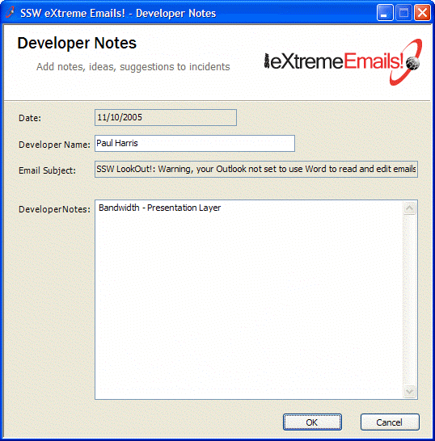
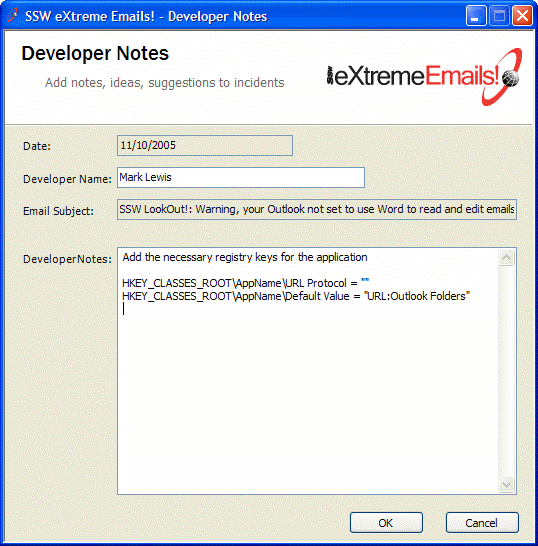
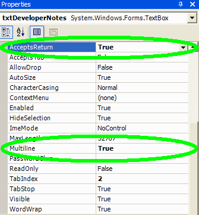

If you have a multi-line textbox in a form, you should make the "Enter" key go to the next line in the text box, rather than cause it to hit the OK button.

<!--endintro-->

::: bad

:::

::: good

:::

It can be done by assigning "True" value to AcceptsReturn and Multiline options in properties bar.

