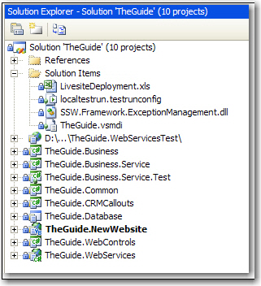
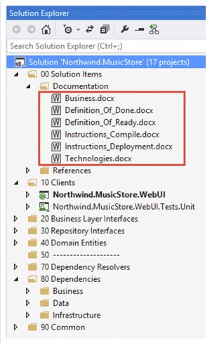
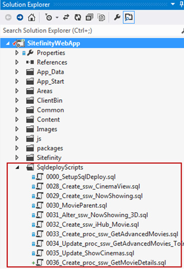

Developers are better at coding then creating documentation. However project instructions are very important to enable developers to get up and running quickly.

<!--endintro-->

In the prior rule: [Do you make awesome documentation?](https://www.ssw.com.au/rules/awesome-documentation) We looked at the kinds of documents you need and how to structure them.

There are 5 levels of project documentation. Documentation can start simple but ends up having a lot of manual steps. The best projects have simple documentation but automate as many steps as possible (level 4 and 5).

### Level #1 - Lots of documentation step by step

Add a document as a solution item and name it '\_Instructions.docx'

Tip: Microsoft Word documents are preferred over .txt files because images and formatting are important

You can also break up this document into 4 smaller documents

* \_Business.docx - Explaining the business purpose of the app
* \_Instructions\_Compile.docx - Contains instructions on how to get the project to compile
* \_Instructions\_Deployment.docx - Describes the deployment process
* \_Technologies.docx - Explaining the technical overview e.g. Broad architecture decisions, 3rd party utilities, patterns followed etc

Here's a suggestion of what these documents could contain.

1. Project structure 
          All parts that composes the project and how they work with each other.
2. Third party components 
          Any software, tools and DLL files that this project uses. (e.g., NHibernate, ComponentArt, KendoUI)
3. Database configuration
4. Other configuration information
5. Deployment information and procedures 

6. Other things to take care of

::: bad  
  
:::

::: good  
  
:::

Add a readme.md to your solution (Use [this](https://docs.microsoft.com/en-us/azure/devops/project/wiki/markdown-guidance?view=vsts)  as a guidance for markdown)

### Level #2: Lots of documentation (and the \*exact\* steps to Get Latest and compile)

When a new developer starts on a project you want them to get up and running as soon as possible.

::: greybox
If you were at Level 2 you might have a document that says:
Dear Northwind Developer
     This documentation describes what is required to configure a developer PC.

Problems to check for:
Windows 8 not supported
Many things to build
Lots of dependencies

:::

You are at Level 2 when you have some static Word documents with the steps to compile. The \_instructions\_compile.docx contains the steps required to be able to get latest and compile.

### Level #3: Lots of documentation (and the exact steps to Get Latest and compile with the \*database\*)

  

### Level #4: Less documentation (and Get Latest and compile with a PowerShell script)

A perfect solution would need no static documentation. Perfect code would be so self-explanatory that it did not need comments. The same rule applies with instructions on how to get the solution compiling: the best answer would be for the solution to contain scripts that automate the setup.

Example of Level 6: PowerShell Documentation

**Recommendation:** All manual workstation setup steps should be scripted with powerShell (as per the below example)

**Recommendation:** You should be able to get latest and compile within 1 minute. Also, a developer machine should not HAVE to be on the domain (to support external consultants)

::: greybox
PS C:\Code\Northwind&gt; **.\Setup-Environment.ps1** 

Problem: Azure environment variable run state directory is not configured (\_CSRUN\_STATE\_DIRECTORY).
 
Problem: Azure Storage Service is not running. Launch the development fabric by starting the solution.
 
WARNING: Abandoning remainder of script due to critical failures.
 
To try and automatically resolve the problems found, re-run the script with a -Fix flag.

:::

::: good
Figure: Good example - you see the problems in the devs environment

:::

::: greybox

PS C:\Code\Northwind&gt; .\Setup-Environment.ps1 -fix

Problem: Azure environment variable run state directory is not configured (\_CSRUN\_STATE\_DIRECTORY).

Fixed: \_CSRUN\_STATE\_DIRECTORY user variable set
 
Problem: Azure Storage Service is not running. Launch the development fabric by starting the solution.

WARNING: No automated fix availab le for 'Azure Storage Service is running'
 
WARNING: Abandoning remainder of script due to critical failures.

:::

::: good
Figure: Good example - when running with -fix this script tries to automatically fix the problem 
      

:::

::: greybox

PS C:\Code\Northwind&gt; .\Setup-Environment.ps1 -fix

Problem: Azure Storage Service is not running. Launch the development fabric by starting the solution.
WARNING: No automated fix available for 'Azure Storage Service is running'

WARNING: Abandoning remainder of script due to critical failures.

:::

::: good
Figure: Good example -  Note that on the 2nd run, issues resolved by the 1st run are not re-reported 
      

:::

### Level #5 Docker Containerization

Docker can make the experience even better for your developers. Development environments are liable to break easily or have documentation fall out of date. This problem is exacerbated when a developer comes back to a project after a long time away. 

Docker containerization helps to standardize development environments. By using docker containers developers won't need to worry about the technologies and versions installed on their device. Everything will be set up for them at the click of a button. Microsoft has a great [tutorial](https://docs.microsoft.com/en-us/learn/modules/use-docker-container-dev-env-vs-code/) and [documentation](https://code.visualstudio.com/docs/remote/containers) on setting up docker containers as development environments for VS Code. 

## Further Reading

To see other documentation Rules, have a look at [Do you make awesome documentation?](https://www.ssw.com.au/rules/awesome-documentation)
