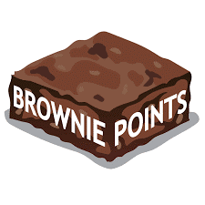

People are not mind-readers (unless they are telepathic!), so when you get good feedback from a client, make sure you get the recognition for it. There is nothing wrong with getting brownie points for the work you have done and making sure the boss at the client site and your manager know about it.

<!--endintro-->

::: email-template  
| | |
| -------- | --- |
| From: | Sophie Belle - SSW Developer |
| To: | John Smith - CEO Qwerty Organization |
| Cc: | Adam Cogan - SSW Manager |
| Subject: | FW: .NET Development Work for Qwerty Organization by SSW |  
::: email-content

### Hi John,

FYI - see the email below. As you can see, I am loved :)

Regards,  
Sophie Belle

---

**To:** Sophie Belle - SSW Developer  
**From:** Amanda Panda - Qwerty Organization  
**Subject:** .NET Development Work for Qwerty Organization by SSW

### Sophie,

Thanks for the latest release.

It is fantastic! Thank you for all your hard work and commitment to helping implement this solution.

Regards,  
Amanda Panda  
Qwerty Organization

:::  
:::  
**Figure: Developers, when you get good feedback from anyone at the client's company, forward their comments onto the boss at the client's company and CC your manager**

> It’s not good enough just to do good work. You’ve gotta do good work and be visible.  
>  - [Adam Cogan](https://www.ssw.com.au/people/adam-cogan)

Assuming you are an awesome worker, there are a whole bunch of smaller ways of getting brownie points and they are all around good communication:

- Doing or sending a [Daily Scrum](/methodology-do-you-do-daily-scrums-aka-stand-up-meetings)
- Sending a "[To myself](/dones-do-you-send-yourself-emails)" after taking requirements from a client
- Sending a [Done](/done-do-you-know-when-to-send-a-done-email-in-scrum) with a screenshot after you have completed the task
- Doing a [Done Video](/do-you-send-done-videos)
- Preparing and doing a great [Sprint Review](/do-you-know-what-happens-at-a-sprint-review-meeting) and sending an [email](/sprint-review-retro-email)
- Sending an [invoice with plenty of comments](/do-you-know-how-to-describe-the-work-you-have-done-while-avoiding-the-word-bug)
- Sharing your knowledge at a [user group](https://www.ssw.com.au/ssw/NETUG/) or presentation
- [Recording or live-streaming your user group presentation](https://www.ssw.com.au/ssw/Consulting/Video-Production/Conference-Video-Recording.aspx) and uploading it to Youtube
