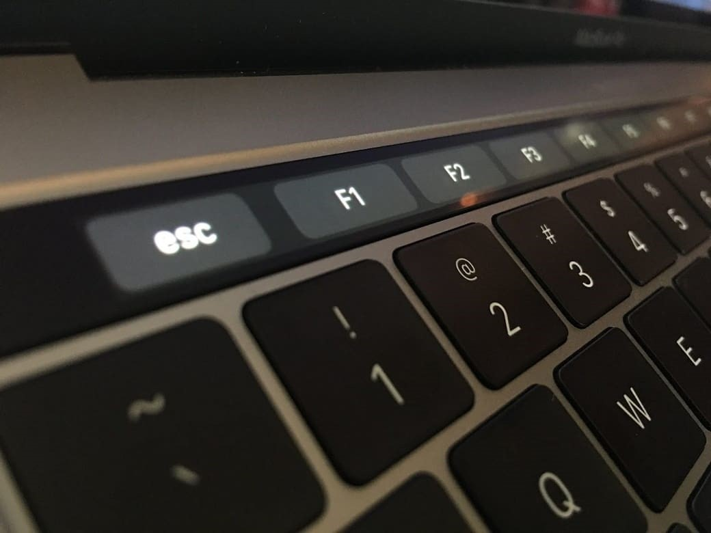
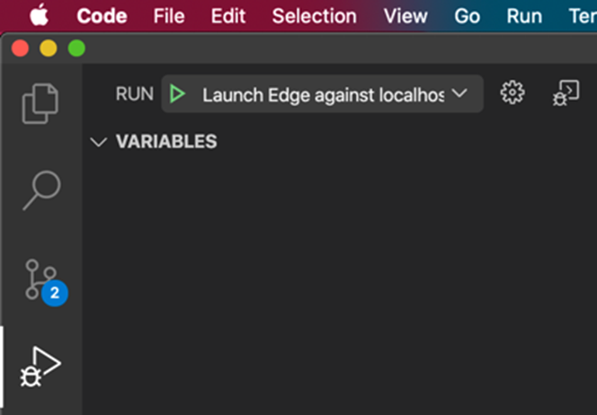

It's amazing how often you can't simply Clone a repository (aka "Get Latest") and compile it.

A good developer makes it clear how to get a new project, compile it, and have a smooth "F5" experience.

  

<!--endintro-->

Check they have a README or instruction files in their solution as per the rule [Do you make instructions at the beginning of a project and improve them gradually?](/do-you-make-instructions-at-the-beginning-of-a-project-and-improve-them-gradually)

### Sometimes the experience is more CLI based

  

### Sometimes the experience is more Mac-based

  

  

