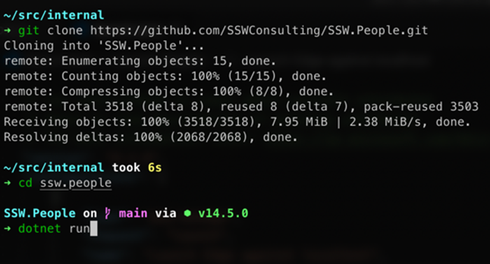
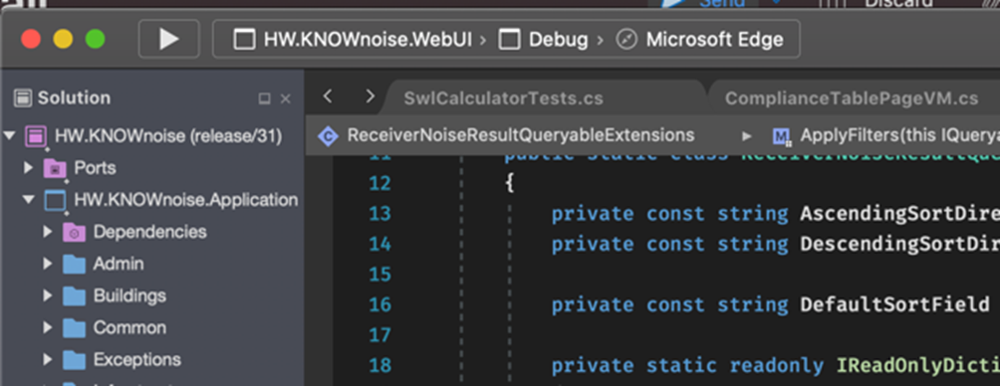

It's amazing how often you can't simply Clone a repository (aka "Get Latest") and compile it. 

​A good developer makes it clear how to get a new project, compile it, and have a smooth "F5" experience. 

<dl class="image"><dt></dt></dl>
 <excerpt class='endintro'></excerpt> 

​Check they have a README or instruction files in their solution as per the rule <a href=/do-you-make-instructions-at-the-beginning-of-a-project-and-improve-them-gradually>Do you make instructions at the beginning of a project and improve them gradually?</a>  
<h3 class="ssw15-rteElement-H3">Sometimes the experience is more CLI based​​​ </h3><dl class="image"><dt></dt><dd>Figure: Some consider this rule (Do you get latest and compile) to be more a “git clone” and then “dotnet run” </dd></dl><h3 class="ssw15-rteElement-H3">Sometimes the experience is more Mac-based​ </h3><dl class="image"><dt></dt><dd>Figure: On a MacBook, if you hold down the Fn key, the touch bar will show F buttons</dd></dl><dl class="image"><dt></dt><dd>Figure: On a MacBook, VSCode has a run button to launch the debugger (similar to F5)</dd></dl><dl class="image"><dt></dt><dd>Figure: On a MacBook, Visual Studio for Mac is similar to VSCode but less obvious, since it looks more like XCode</dd>
</dl>

